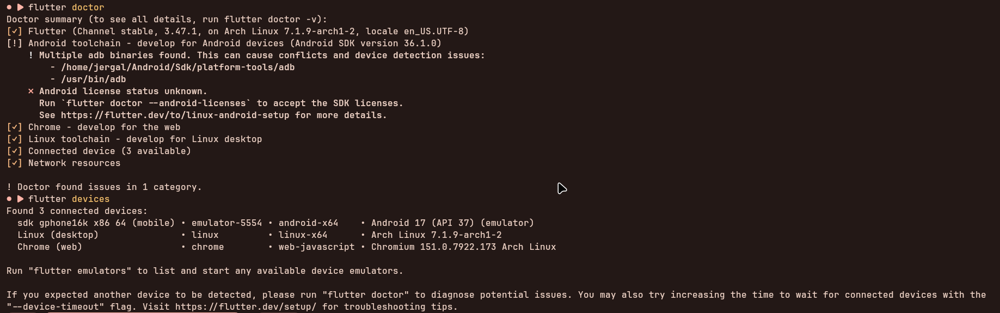
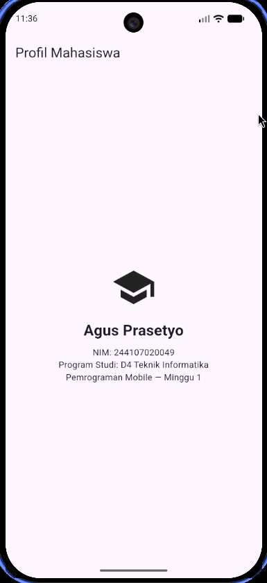

# Minggu 1: Mobile Development Ecosystem & Flutter Refresh

Dokumentasi dan laporan tugas praktikum Minggu 1 mata kuliah Pemrograman Mobile.

## Identitas Mahasiswa

- Nama: Agus Prasetyo
- NIM: 244107020049
- Mata Kuliah: Pemrograman Mobile
- Program Studi: D4 Teknik Informatika

## Checklist Verifikasi

- [x] `flutter doctor`: Tidak ada isu kritis yang menghambat target pengembangan Android.
- [x] `flutter devices`: Emulator Android (`sdk gphone16k x86 64` / `emulator-5554`) dan target desktop/web terdeteksi dengan baik.
- [x] Aplikasi Berjalan: Aplikasi Flutter berjalan lancar dan UI default telah diganti dengan profil sederhana.
- [x] Perbedaan Hot Reload vs Hot Restart: Penjelasan lengkap mengenai perbedaan mekanisme keduanya.
- [x] Repository Remote: Berisi source code, README, screenshot, dan riwayat commit.

### Bukti Verifikasi Lingkungan

### Perbedaan Hot Reload dan Hot Restart

| Aspek | Hot Reload (`r`) | Hot Restart (`R`) |
| :--- | :--- | :--- |
| Mekanisme Kerja | Menyuntikkan (*inject*) kode sumber yang diperbarui ke dalam Dart Virtual Machine (VM) yang sedang berjalan tanpa memulai ulang aplikasi. | Mengkompilasi ulang kode sumber dan memuat ulang Dart VM dari titik awal (`main()`). |
| State Aplikasi | Mempertahankan State (*state preserved*). Nilai variabel, input form, atau posisi scroll tidak akan ter-reset. | Mereset State (*state destroyed*). Seluruh state kembali ke nilai awal dan siklus hidup widget (`initState()`) dijalankan ulang. |
| Kecepatan | Sangat cepat (kurang dari 1 detik / sub-second). | Cepat (1–3 detik), namun sedikit lebih lambat dibanding Hot Reload karena inisialisasi ulang. |
| Penggunaan yang Tepat | Perubahan UI, perbaikan styling/warna/padding, penyesuaian tata letak widget, atau logika kecil di dalam method `build()`. | Perubahan nilai inisialisasi state, penambahan aset di `pubspec.yaml`, perubahan pada `main()`, `initState()`, atau dependensi. |

## Mini Assignment: Aplikasi Profil Mahasiswa

### Deskripsi Implementasi

Aplikasi profil mahasiswa dibuat berdasarkan praktikum menggunakan widget dasar Flutter:
- `Scaffold` & `AppBar`: Struktur halaman dan bar judul aplikasi.
- `Icon`: Menampilkan ikon kampus (`Icons.school`).
- `Text`: Menampilkan data Nama (`Agus Prasetyo`), NIM (`244107020049`), Program Studi (`D4 Teknik Informatika`), dan Mata Kuliah (`Pemrograman Mobile — Minggu 1`).
- `Column` & `Center`: Mengatur perataan dan tata letak vertikal widget secara terpusat.
- `SizedBox`: Memberikan jarak (*spacing*) antar-elemen.

### Tangkapan Layar (Screenshot)

## Refleksi

### 1. Kapan native lebih tepat dipilih daripada cross-platform?

Pendekatan Native (Kotlin/Java untuk Android, Swift/Objective-C untuk iOS) lebih tepat dipilih dibandingkan cross-platform pada situasi berikut:
- Kebutuhan Akses Hardware Tingkat Rendah & Mendalam:
  - Aplikasi yang memerlukan integrasi perangkat keras khusus, seperti sensor industri, komunikasi Bluetooth Low Energy (BLE) lanjutan, kontrol periferal USB/NFC khusus, atau pemrosesan kamera kustom low-latency.
- Performa Komputasi & Grafis Ekstrem:
  - Aplikasi pengolah grafis berat, rendering 3D intensif, pemrosesan video/audio real-time, atau aplikasi AR/VR yang membutuhkan akses langsung ke API bawaan platform tanpa overhead lapisan abstraksi.
- Optimasi Ukuran Binary & Ketergantungan Minimal:
  - Ketika aplikasi ditargetkan memiliki ukuran file (app size) sekecil mungkin dan performa startup time instan tanpa runtime engine tambahan.

### 2. Bagaimana perubahan state berhubungan dengan widget tree dan UI deklaratif?

- Paradigma Deklaratif ($UI = f(state)$):
  - Dalam Flutter, antarmuka pengguna didefinisikan sebagai fungsi dari state. Developer tidak mengubah elemen UI secara imperatif, melainkan memperbarui nilai state dan membiarkan framework membangun ulang tampilannya.
- Hubungan dengan Widget Tree:
  - Ketika state berubah (misalnya melalui pemanggilan `setState()` pada `StatefulWidget` atau state management lainnya), framework menandai elemen terkait di element tree sebagai dirty.
  - Flutter kemudian memicu method `build()` untuk menghasilkan widget tree baru yang merefleksikan data terkini.
  - Framework melakukan proses reconciliation (diffing) yang efisien antara widget tree baru dengan pohon rendering yang sudah ada. Hanya `RenderObject` yang mengalami perubahan yang akan di-repaint atau di-relayout.

### 3. Mengapa commit kecil dengan pesan jelas bermanfaat bagi pekerjaan tim dan portfolio?

- Manfaat bagi Pekerjaan Tim:
  - Kemudahan Peninjauan Kode (Code Review): Commit yang berukuran kecil dan berfokus pada satu tujuan (atomic commit) memudahkan rekan tim memahami konteks perubahan secara cepat tanpa beban kognitif berlebih.
  - Kemudahan Debugging & Pelacakan Regresi: Apabila ditemukan bug, tim dapat menggunakan `git bisect` untuk menemukan titik kegagalan secara presisi, atau melakukan `git revert` pada satu commit tertentu tanpa merusak fitur lainnya.
  - Meminimalkan Konflik Penggabungan (Merge Conflicts): Perubahan bertahap yang terisolasi dengan baik memperkecil kemungkinan terjadinya conflict saat proses integrasi cabang.
- Manfaat bagi Portfolio & Kredibilitas Profesional:
  - Mencerminkan Disiplin dan Cara Berpikir Terstruktur: Penggunaan pesan commit yang bermakna memperlihatkan kepada evaluator bahwa developer memiliki etos kerja yang terorganisir dan standar rekayasa perangkat lunak yang matang.
  - Dokumentasi Historis yang Jelas: Riwayat commit berfungsi sebagai log perjalanan proyek yang menceritakan bagaimana solusi dibangun langkah demi langkah dari awal hingga akhir.
