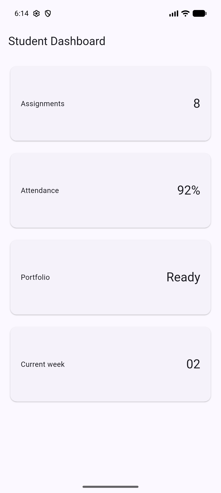
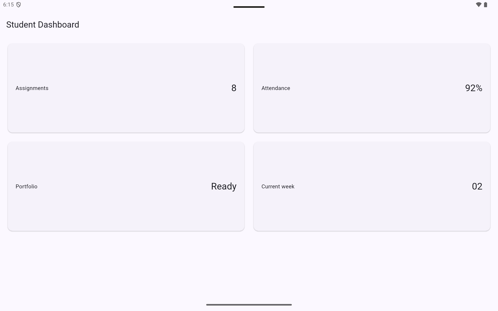

# Minggu 2: Declarative UI & Responsive Design

Dokumentasi dan laporan tugas praktikum Minggu 2 mata kuliah Pemrograman Mobile.

## Identitas Mahasiswa

- Nama: Agus Prasetyo
- NIM: 244107020049
- Mata Kuliah: Pemrograman Mobile
- Program Studi: D4 Teknik Informatika

## Praktikum Warm-up: Kartu Profil

### Deskripsi Implementasi

Pada praktikum warm-up, saya membuat kartu profil sederhana untuk berlatih widget dasar sebelum masuk ke dashboard responsif:

- `Container`: Membungkus seluruh kartu dengan ukuran tetap (`width: 320`), padding, dan dekorasi (`BoxDecoration` dengan warna latar `Colors.indigo.shade50` dan sudut membulat).
- `Column` dengan `mainAxisSize: MainAxisSize.min`: Menyusun baris-baris data secara vertikal dengan ukuran minimal sesuai konten.
- `Row` + `Expanded`: Menyusun avatar dan nama secara horizontal. `Expanded` memastikan teks nama mengisi sisa ruang tanpa overflow.
- `CircleAvatar`: Menampilkan ikon profil dalam bentuk lingkaran.

### Tangkapan Layar

## Praktikum Dashboard: Layout Responsif

### Deskripsi Implementasi

Setelah warm-up, saya membangun dashboard mahasiswa yang bisa menyesuaikan layout tergantung lebar layar:

- `MaterialApp` dengan `theme` dan `darkTheme`: Mendukung tema terang dan gelap secara otomatis mengikuti pengaturan sistem.
- `LayoutBuilder`: Membaca lebar layar yang tersedia (`constraints.maxWidth`) untuk menentukan jumlah kolom secara dinamis.
- `GridView.count`: Menampilkan kartu-kartu informasi dalam grid dengan `crossAxisCount` yang berubah berdasarkan breakpoint 700 piksel.
- `DashboardCard` (custom `StatelessWidget`): Widget reusable yang menerima `title` dan `value`, menampilkan informasi dalam `Card` dengan `Row`.

Kalau layar kurang dari 700px, kartu ditampilkan satu kolom. Kalau 700px atau lebih, kartu ditampilkan dua kolom.

### Tangkapan Layar

| Layar 5 inci (1 kolom) | Layar 10 inci (2 kolom) |
| :---: | :---: |
|  |  |
