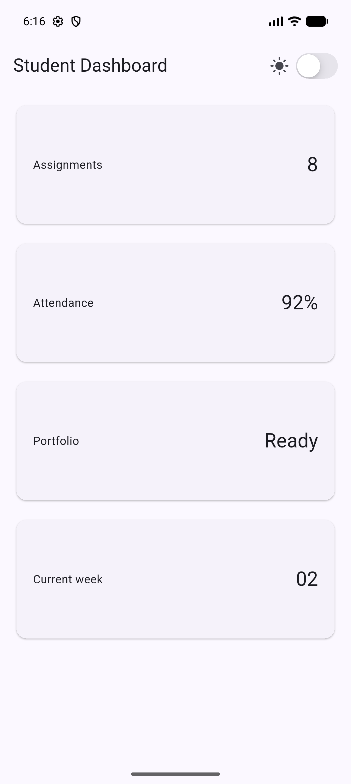
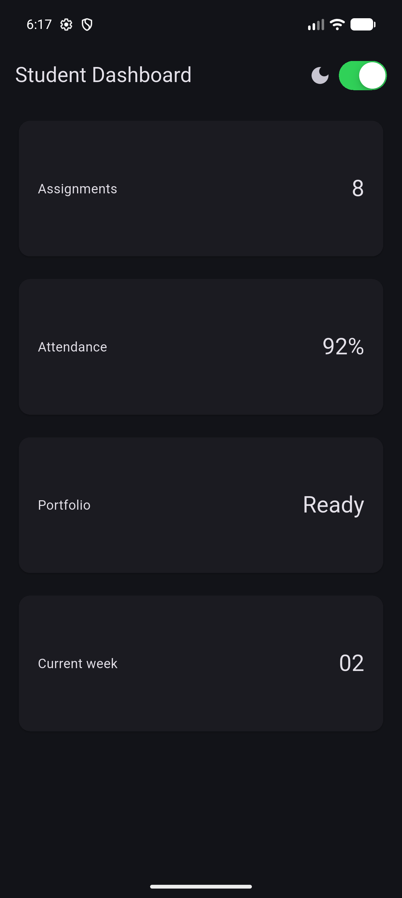
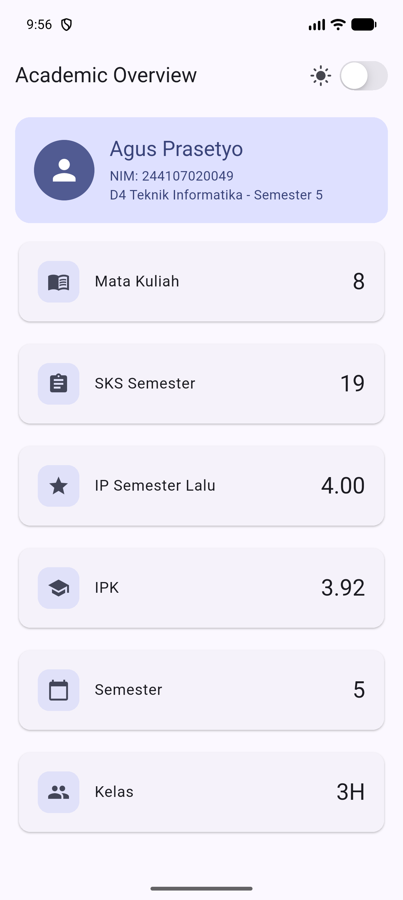
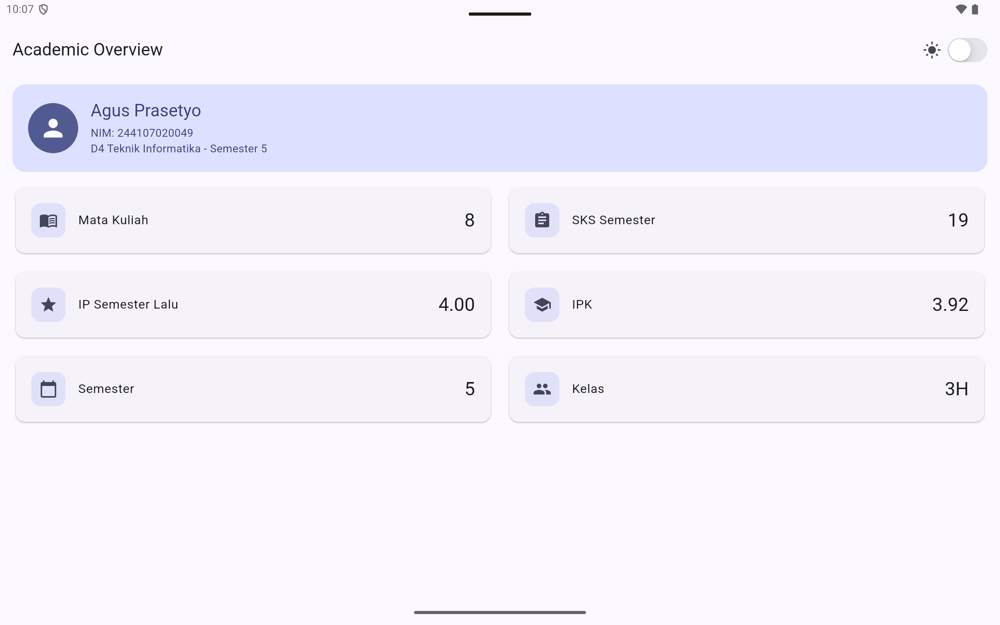
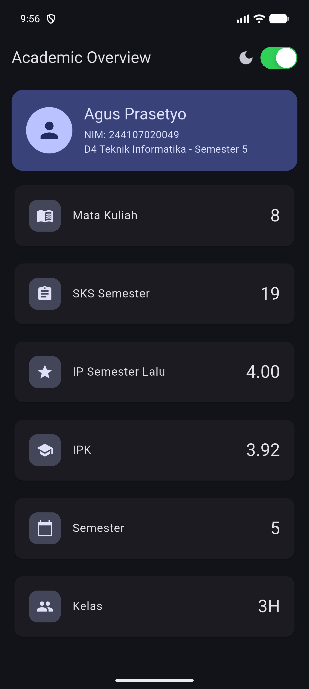

# Minggu 2: Declarative UI & Responsive Design

Dokumentasi dan laporan tugas praktikum Minggu 2 mata kuliah Pemrograman Mobile.

## Identitas Mahasiswa

- Nama: Agus Prasetyo
- NIM: 244107020049
- Mata Kuliah: Pemrograman Mobile
- Program Studi: D4 Teknik Informatika

## Praktikum Warm-up: Kartu Profil

### Deskripsi Implementasi

Pada praktikum warm-up, saya membuat kartu profil sederhana untuk berlatih widget dasar sebelum masuk ke dashboard responsif:

- `Container`: Membungkus seluruh kartu dengan ukuran tetap (`width: 320`), padding, dan dekorasi (`BoxDecoration` dengan warna latar `Colors.indigo.shade50` dan sudut membulat).
- `Column` dengan `mainAxisSize: MainAxisSize.min`: Menyusun baris-baris data secara vertikal dengan ukuran minimal sesuai konten.
- `Row` + `Expanded`: Menyusun avatar dan nama secara horizontal. `Expanded` memastikan teks nama mengisi sisa ruang tanpa overflow.
- `CircleAvatar`: Menampilkan ikon profil dalam bentuk lingkaran.

### Tangkapan Layar

## Praktikum Dashboard: Layout Responsif

### Deskripsi Implementasi

Setelah warm-up, saya membangun dashboard mahasiswa yang bisa menyesuaikan layout tergantung lebar layar:

- `MaterialApp` dengan `theme` dan `darkTheme`: Mendukung tema terang dan gelap secara otomatis mengikuti pengaturan sistem.
- `LayoutBuilder`: Membaca lebar layar yang tersedia (`constraints.maxWidth`) untuk menentukan jumlah kolom secara dinamis.
- `GridView.count`: Menampilkan kartu-kartu informasi dalam grid dengan `crossAxisCount` yang berubah berdasarkan breakpoint 700 piksel.
- `DashboardCard` (custom `StatelessWidget`): Widget reusable yang menerima `title` dan `value`, menampilkan informasi dalam `Card` dengan `Row`.

Kalau layar kurang dari 700px, kartu ditampilkan satu kolom. Kalau 700px atau lebih, kartu ditampilkan dua kolom.

### Tangkapan Layar

| Layar 5 inci (1 kolom) | Layar 10 inci (2 kolom) |
| :---: | :---: |
|  |  |

## Praktikum Interaksi: StatefulWidget dan Cupertino

### Deskripsi Implementasi

Supaya pengguna bisa ganti tema secara manual, `DashboardApp` diubah menjadi `StatefulWidget`:

- `DashboardApp` menjadi `StatefulWidget`: Menyimpan variabel `isDark` pada objek `State` untuk melacak preferensi tema pengguna.
- `CupertinoSwitch` (dari package `cupertino`): Widget toggle bergaya iOS di `AppBar` actions untuk ganti tema. Sekaligus menunjukkan bahwa komponen Cupertino bisa dipakai di dalam aplikasi Material.
- `ValueChanged<bool>` callback: `DashboardPage` menerima state `isDark` dan callback `onDarkChanged` dari parent, mengikuti pola state-lifting yang umum di Flutter.
- `ThemeMode` bergantung pada state: kalau `isDark` bernilai `true`, tema gelap aktif; kalau `false`, tema terang. Perubahan terjadi langsung tanpa restart.

Ikon di samping switch berubah sesuai mode aktif: `Icons.light_mode` (matahari) untuk tema terang dan `Icons.dark_mode` (bulan sabit) untuk tema gelap.

### Tangkapan Layar

| Tema Terang (Light Mode) | Tema Gelap (Dark Mode) |
| :---: | :---: |
|  |  |

## Tugas Utama: Academic Overview

### Deskripsi Implementasi

Dashboard dikembangkan menjadi halaman Academic Overview dengan spesifikasi berikut:

- `ProfileHeader`: Widget custom yang menampilkan avatar, nama, NIM, dan program studi di dalam `Container` dengan warna `colorScheme.primaryContainer` agar otomatis menyesuaikan tema.
- `InfoCard`: Widget reusable yang menerima `title`, `value`, dan `icon`. Setiap kartu menggunakan `Row` dengan `Expanded` untuk menyusun ikon, label, dan nilai secara horizontal.
- `LayoutBuilder` dengan breakpoint 700px: Menentukan apakah kartu ditampilkan dalam satu kolom (layar sempit) atau dua kolom (layar lebar) menggunakan `Row` + `Expanded`.
- `SingleChildScrollView`: Membungkus seluruh konten agar dapat di-scroll pada layar yang lebih kecil.
- `CupertinoSwitch` pada `AppBar`: Toggle tema gelap/terang yang menggunakan komponen Cupertino di dalam aplikasi Material.
- `Semantics`: Label aksesibilitas ditambahkan pada avatar profil, ikon mode, toggle tema, dan setiap kartu informasi agar bermakna bagi screen reader.

Totalnya ada enam kartu informasi berdasarkan data KRS: Mata Kuliah (8), SKS Semester (19), IP Semester Lalu (4.00), IPK (3.92), Semester (5), dan Kelas (3H). Semua warna diambil dari `Theme.of(context)` supaya teks tetap terbaca di tema terang maupun gelap.

### Tangkapan Layar

| Layar 5 inci, Tema Terang | Layar 10 inci, Tema Terang |
| :---: | :---: |
|  |  |

| Layar 5 inci, Tema Gelap |
| :---: |
|  |
