# Minggu 2: Declarative UI & Responsive Design

Dokumentasi dan laporan tugas praktikum Minggu 2 mata kuliah Pemrograman Mobile.

## Identitas Mahasiswa

- Nama: Agus Prasetyo
- NIM: 244107020049
- Mata Kuliah: Pemrograman Mobile
- Program Studi: D4 Teknik Informatika

## Praktikum Warm-up: Kartu Profil

### Deskripsi Implementasi

Pada praktikum warm-up, saya membuat kartu profil sederhana untuk berlatih widget dasar sebelum masuk ke dashboard responsif:

- `Container`: Membungkus seluruh kartu dengan ukuran tetap (`width: 320`), padding, dan dekorasi (`BoxDecoration` dengan warna latar `Colors.indigo.shade50` dan sudut membulat).
- `Column` dengan `mainAxisSize: MainAxisSize.min`: Menyusun baris-baris data secara vertikal dengan ukuran minimal sesuai konten.
- `Row` + `Expanded`: Menyusun avatar dan nama secara horizontal. `Expanded` memastikan teks nama mengisi sisa ruang tanpa overflow.
- `CircleAvatar`: Menampilkan ikon profil dalam bentuk lingkaran.

### Tangkapan Layar

## Praktikum Dashboard: Layout Responsif

### Deskripsi Implementasi

Setelah warm-up, saya membangun dashboard mahasiswa yang bisa menyesuaikan layout tergantung lebar layar:

- `MaterialApp` dengan `theme` dan `darkTheme`: Mendukung tema terang dan gelap secara otomatis mengikuti pengaturan sistem.
- `LayoutBuilder`: Membaca lebar layar yang tersedia (`constraints.maxWidth`) untuk menentukan jumlah kolom secara dinamis.
- `GridView.count`: Menampilkan kartu-kartu informasi dalam grid dengan `crossAxisCount` yang berubah berdasarkan breakpoint 700 piksel.
- `DashboardCard` (custom `StatelessWidget`): Widget reusable yang menerima `title` dan `value`, menampilkan informasi dalam `Card` dengan `Row`.

Kalau layar kurang dari 700px, kartu ditampilkan satu kolom. Kalau 700px atau lebih, kartu ditampilkan dua kolom.

### Tangkapan Layar

| Layar 5 inci (1 kolom) | Layar 10 inci (2 kolom) |
| :---: | :---: |
|  |  |

## Praktikum Interaksi: StatefulWidget dan Cupertino

### Deskripsi Implementasi

Supaya pengguna bisa ganti tema secara manual, `DashboardApp` diubah menjadi `StatefulWidget`:

- `DashboardApp` menjadi `StatefulWidget`: Menyimpan variabel `isDark` pada objek `State` untuk melacak preferensi tema pengguna.
- `CupertinoSwitch` (dari package `cupertino`): Widget toggle bergaya iOS di `AppBar` actions untuk ganti tema. Sekaligus menunjukkan bahwa komponen Cupertino bisa dipakai di dalam aplikasi Material.
- `ValueChanged<bool>` callback: `DashboardPage` menerima state `isDark` dan callback `onDarkChanged` dari parent, mengikuti pola state-lifting yang umum di Flutter.
- `ThemeMode` bergantung pada state: kalau `isDark` bernilai `true`, tema gelap aktif; kalau `false`, tema terang. Perubahan terjadi langsung tanpa restart.

Ikon di samping switch berubah sesuai mode aktif: `Icons.light_mode` (matahari) untuk tema terang dan `Icons.dark_mode` (bulan sabit) untuk tema gelap.

### Tangkapan Layar

| Tema Terang (Light Mode) | Tema Gelap (Dark Mode) |
| :---: | :---: |
|  |  |

## Tugas Utama: Academic Overview

### Deskripsi Implementasi

Dashboard dikembangkan menjadi halaman Academic Overview dengan spesifikasi berikut:

- `ProfileHeader`: Widget custom yang menampilkan avatar, nama, NIM, dan program studi di dalam `Container` dengan warna `colorScheme.primaryContainer` agar otomatis menyesuaikan tema.
- `InfoCard`: Widget reusable yang menerima `title`, `value`, dan `icon`. Setiap kartu menggunakan `Row` dengan `Expanded` untuk menyusun ikon, label, dan nilai secara horizontal.
- `LayoutBuilder` dengan breakpoint 700px: Menentukan apakah kartu ditampilkan dalam satu kolom (layar sempit) atau dua kolom (layar lebar) menggunakan `Row` + `Expanded`.
- `SingleChildScrollView`: Membungkus seluruh konten agar dapat di-scroll pada layar yang lebih kecil.
- `CupertinoSwitch` pada `AppBar`: Toggle tema gelap/terang yang menggunakan komponen Cupertino di dalam aplikasi Material.
- `Semantics`: Label aksesibilitas ditambahkan pada avatar profil, ikon mode, toggle tema, dan setiap kartu informasi agar bermakna bagi screen reader.

Totalnya ada enam kartu informasi berdasarkan data KRS: Mata Kuliah (8), SKS Semester (19), IP Semester Lalu (4.00), IPK (3.92), Semester (5), dan Kelas (3H). Semua warna diambil dari `Theme.of(context)` supaya teks tetap terbaca di tema terang maupun gelap.

### Tangkapan Layar

| Layar 5 inci, Tema Terang | Layar 10 inci, Tema Terang |
| :---: | :---: |
|  |  |

| Layar 5 inci, Tema Gelap |
| :---: |
|  |

## Refactoring Challenge

### Perubahan yang Dilakukan

1. **Widget reusable `InfoCard`**: Kartu informasi sudah diekstrak menjadi widget tersendiri yang menerima `title`, `value`, dan `icon`, sehingga tidak ada duplikasi widget.
2. **Penggunaan `Theme.of(context)`**: Semua warna dan ukuran teks diambil dari `colorScheme` dan `textTheme` tema aktif, bukan ditulis langsung di kode. Jadi tampilan otomatis ikut berubah saat tema berganti.
3. **Konstanta breakpoint**: Nilai breakpoint dipindahkan ke satu konstanta bernama `const kWideBreakpoint = 700.0` di level atas file, sehingga hanya didefinisikan satu kali dan mudah diubah.
4. **`flutter analyze`**: Tidak ditemukan error maupun warning.

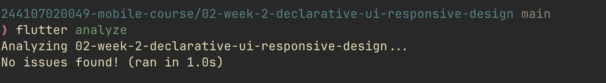

## Testing Dasar

### Widget Test Responsif

Dua widget test ditambahkan di `test/widget_test.dart` untuk memverifikasi perilaku responsif:

1. **Dashboard satu kolom di layar sempit**: Mengatur ukuran layar virtual ke 400x800 piksel, lalu memverifikasi bahwa lebar `InfoCard` lebih dari 350px (memenuhi seluruh lebar layar, menandakan layout satu kolom).
2. **Dashboard dua kolom di layar lebar**: Mengatur ukuran layar virtual ke 1200x800 piksel, lalu memverifikasi bahwa lebar `InfoCard` kurang dari 600px (menandakan kartu berbagi ruang dalam dua kolom).

Kedua test memanfaatkan `tester.view.physicalSize` dan `tester.view.devicePixelRatio` untuk mensimulasikan ukuran layar, serta `addTearDown(tester.view.reset)` agar pengaturan dikembalikan setelah test selesai.

Hasil: kedua test lulus (`All tests passed!`).

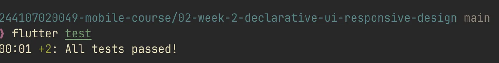

## Checklist Verifikasi

- [x] `flutter analyze` tidak menghasilkan error.
- [x] `flutter test` lulus semua widget test responsif.
- [x] Aplikasi dapat dijalankan pada ukuran layar sempit (5 inci) dan lebar (10 inci).
- [x] Dark mode memiliki kontras dan teks yang terbaca.
- [x] Struktur widget dapat dijelaskan saat code review.
- [x] Screenshot, folder `test/`, dan README sudah tersimpan pada folder tugas Week 2.

## AI Prompt Challenge

Sumber percakapan: [ChatGPT - Bandingkan Layout Dashboard](https://chatgpt.com/share/6a9d7876-be74-83ec-8643-2a045d6173ab)

### Prompt 1: Perbandingan Tata Letak

**Prompt:** "Bandingkan dua tata letak dashboard akademik untuk Flutter: versi `GridView` dan versi `LayoutBuilder` + `Column`. Jelaskan trade-off responsif dan aksesibilitasnya."

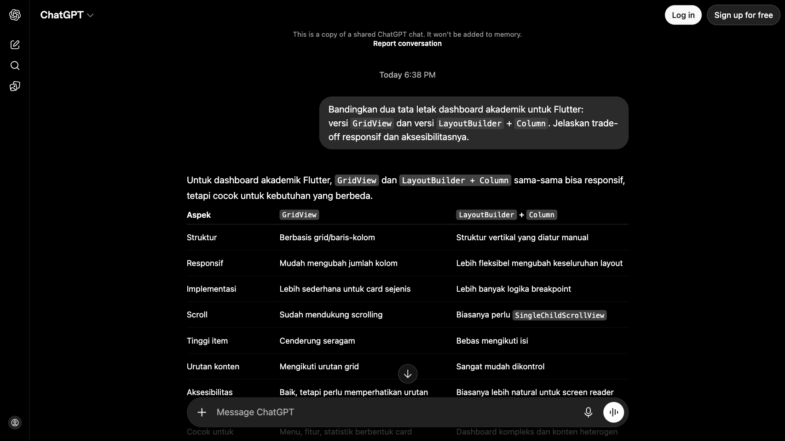

**Ringkasan Output:**

ChatGPT memberikan tabel perbandingan aspek-aspek kedua pendekatan:

| Aspek | `GridView` | `LayoutBuilder` + `Column` |
| :--- | :--- | :--- |
| Responsif | Mudah mengubah jumlah kolom | Lebih fleksibel mengubah keseluruhan layout |
| Tinggi item | Cenderung seragam | Bebas mengikuti isi |
| Aksesibilitas | Baik, tetapi perlu memperhatikan urutan grid | Biasanya lebih natural untuk screen reader |
| Cocok untuk | Menu, fitur, statistik berbentuk card | Dashboard kompleks dan konten heterogen |

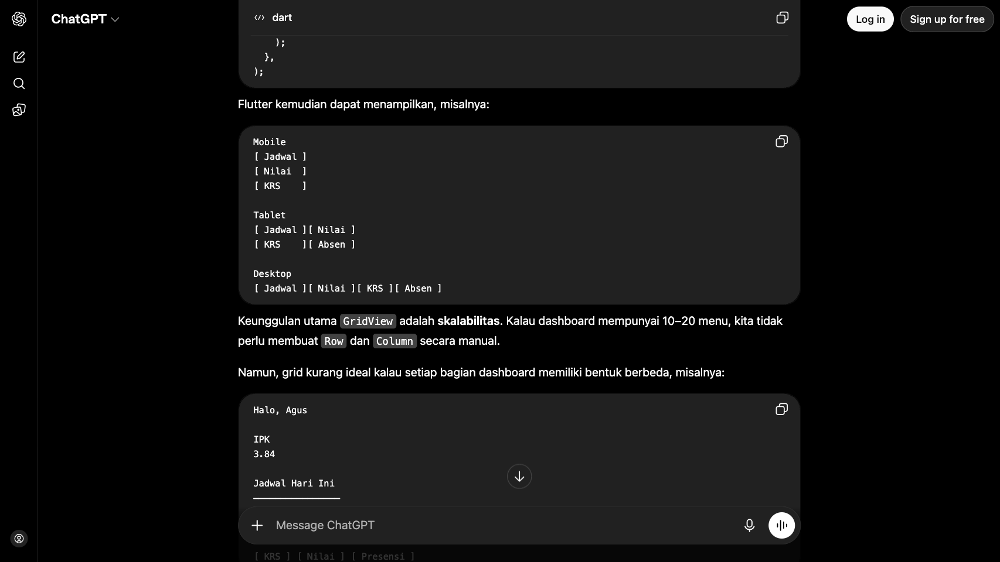

Kesimpulan dari AI: `GridView` unggul untuk *responsive sizing* otomatis (semakin lebar layar, semakin banyak card per baris), sedangkan `LayoutBuilder` + `Column` unggul untuk *responsive composition* (struktur dashboard berubah berdasarkan ukuran layar). Untuk dashboard nyata, AI merekomendasikan kombinasi keduanya.

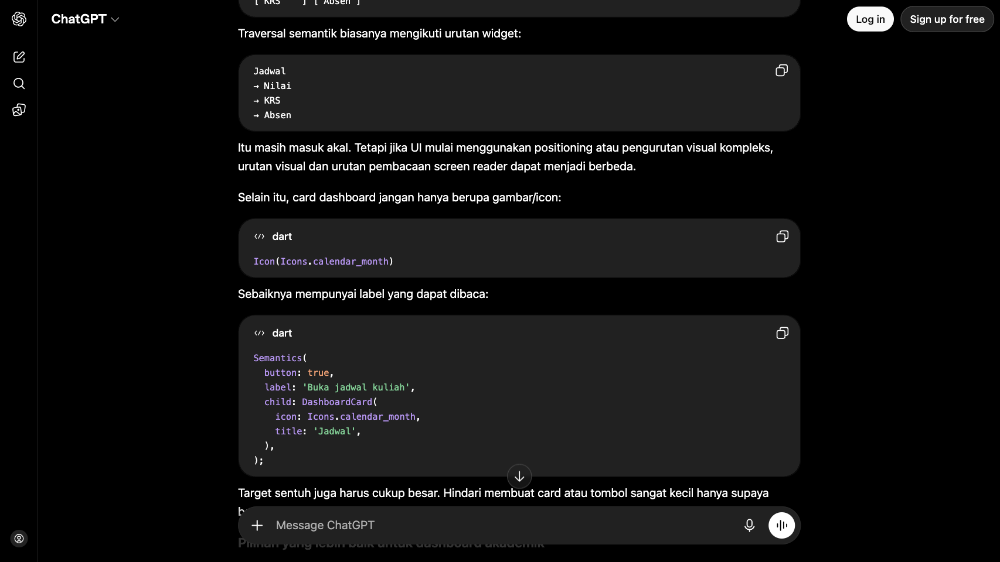

**Keputusan:** Menggunakan `LayoutBuilder` + `Column` + `Row` + `Expanded` pada tugas utama karena header profil memiliki tinggi berbeda dari kartu informasi, sehingga `childAspectRatio` seragam dari `GridView` tidak ideal.

### Prompt 2: Penguatan Konsep Expanded

**Prompt:** "Jelaskan kapan penggunaan `Expanded` justru menyebabkan overflow di dalam `Row`, beri contoh kode yang gagal dan perbaikannya."

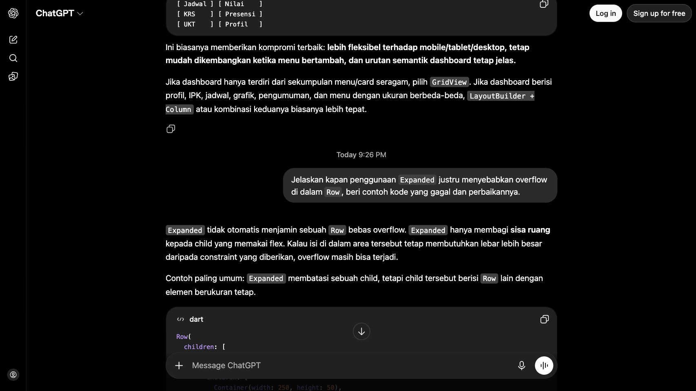

**Ringkasan Output:**

AI menjelaskan tiga kasus utama kegagalan `Expanded`:

1. **Child dengan ukuran tetap melebihi ruang**: `Expanded` membungkus `Row` yang berisi dua `Container(width: 250)`. Di layar 360px, total kebutuhan 500px menyebabkan overflow. Perbaikan: ganti child dengan `Expanded` juga agar ikut fleksibel.
2. **Sibling non-flex terlalu lebar**: `Container(width: 300)` dan `Container(width: 100)` sebagai sibling sudah membutuhkan 400px, melebihi ruang 360px. `Expanded` tidak bisa memperbaiki ini. Perbaikan: perkecil ukuran tetap sibling.
3. **`Row` di dalam `SingleChildScrollView` horizontal**: `Expanded` di dalam scroll horizontal mendapat constraint tak terbatas, menyebabkan assertion error karena konsepnya bertentangan. Perbaikan: hapus `Expanded`, gunakan ukuran eksplisit.

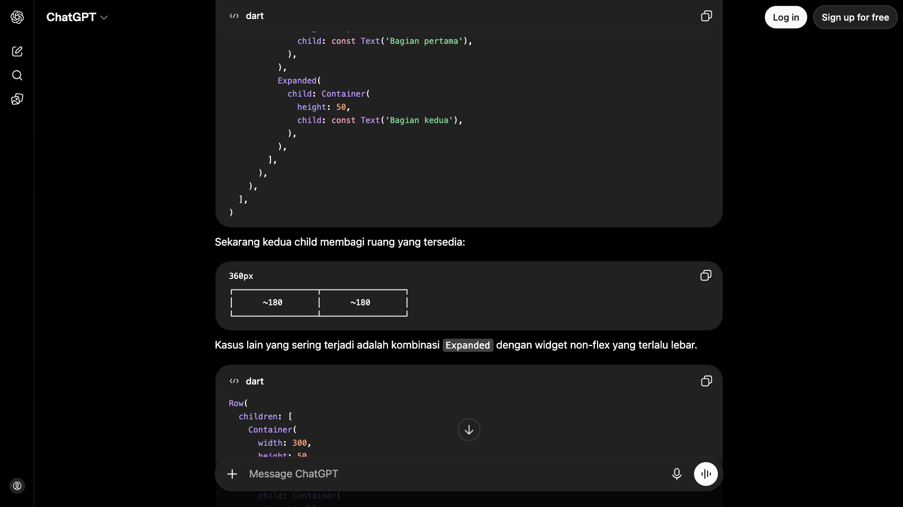

Aturan praktis dari AI: `Expanded` cocok ketika parent memiliki ruang terbatas dan child memang boleh mengecil/membesar mengikuti sisa ruang.

### Prompt 3: Verifikasi

**Prompt:** "Periksa kembali rekomendasi layout di atas: apakah tetap responsif di bawah 600px, apakah mengurangi aksesibilitas, dan apakah ada widget yang tidak tersedia di Flutter stabil saat ini?"

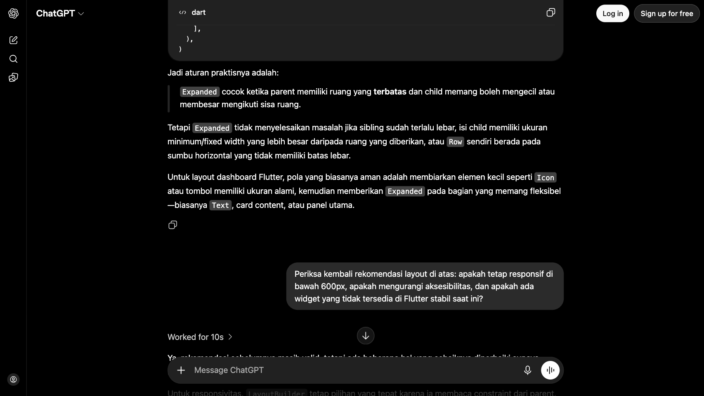

**Ringkasan Output:**

- **Responsivitas di bawah 600px**: `LayoutBuilder` tetap tepat karena membaca constraint dari parent. Di bawah 600px, layout harus berubah ke `Column` agar tidak overflow. AI juga mengoreksi rekomendasi sebelumnya: `GridView` di dalam `SingleChildScrollView` membutuhkan `shrinkWrap: true` dan `NeverScrollableScrollPhysics()` agar tidak konflik scroll.

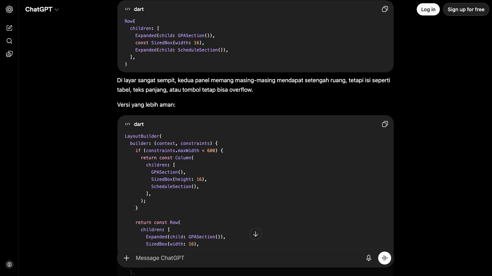

- **Aksesibilitas**: Tidak berkurang selama urutan widget di tree konsisten dengan urutan visual. AI mengingatkan untuk tidak menambahkan `Semantics` secara berlebihan pada widget yang sudah memiliki semantics bawaan (seperti `ElevatedButton`, `ListTile`), karena duplikasi label membuat screen reader membacakan informasi dua kali.

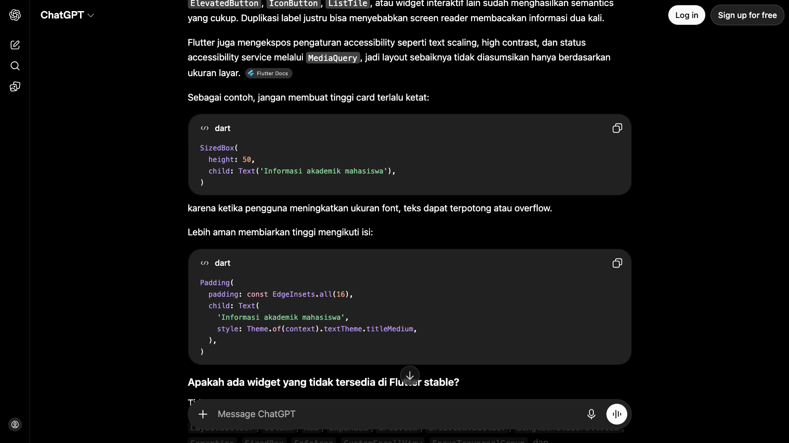

- **Ketersediaan widget**: Semua widget yang direkomendasikan (`LayoutBuilder`, `Column`, `Row`, `Expanded`, `GridView`, `Semantics`, `SingleChildScrollView`, `CustomScrollView`, `FocusTraversalGroup`, `SliverGridDelegateWithMaxCrossAxisExtent`) tersedia di Flutter stable 3.47 saat ini. Tidak ada API eksperimental.

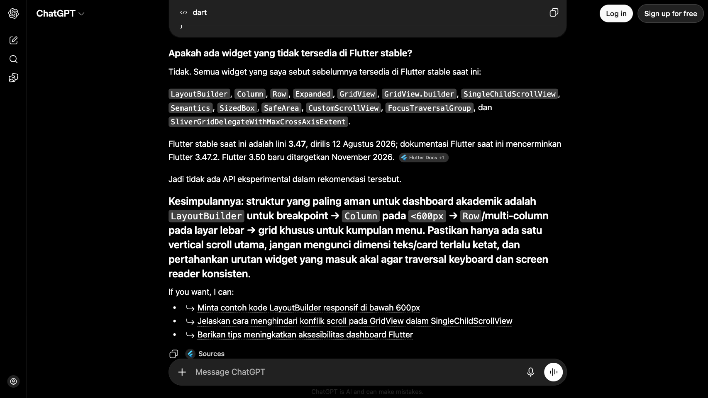

## Refleksi

### 1. Apa perbedaan cara berpikir imperative dan declarative saat membangun UI?

Kalau imperatif, kita langsung ambil referensi elemen lalu ubah propertinya satu per satu (misalnya `setText()`, `setColor()`). Kalau deklaratif seperti Flutter, kita cukup tulis tampilan yang diinginkan di method `build()` berdasarkan state saat ini. Begitu state berubah, Flutter sendiri yang menentukan bagian mana yang perlu di-render ulang. Kita tidak perlu mengelola peralihan antar-state secara manual.

### 2. Kapan Expanded membantu dan kapan penggunaannya justru menghasilkan layout error?

`Expanded` berguna kalau kita ingin child mengisi sisa ruang yang tersedia di `Row` atau `Column` dengan constraint terbatas. Contohnya, teks panjang di samping ikon supaya tidak meluber keluar layar. Tapi `Expanded` justru bermasalah kalau dipakai di parent tanpa batas lebar, seperti `Row` di dalam `ListView` horizontal atau `SingleChildScrollView` horizontal. Di kondisi itu, Flutter tidak bisa menghitung "sisa ruang" karena ruangnya tak terbatas, sehingga muncul error unbounded constraints.

### 3. Bagaimana breakpoint dan theme memengaruhi pengalaman pengguna?

Breakpoint mengontrol kapan layout berubah dari satu kolom ke dua kolom. Kalau breakpoint-nya terlalu rendah, konten jadi terlalu sempit di layar kecil. Kalau terlalu tinggi, layar besar tidak memanfaatkan ruang yang ada. Theme menyimpan warna, tipografi, dan bentuk komponen di satu tempat sehingga dark mode dan light mode konsisten di seluruh aplikasi. Pengguna tinggal ganti pengaturan sistem, dan tampilan langsung menyesuaikan.

### 4. Apa yang diverifikasi dari rekomendasi AI setelah tugas inti selesai?

Saya memverifikasi rekomendasi AI lewat tiga hal: (1) menjalankan aplikasi di emulator 5 inci dan 10 inci untuk melihat langsung apakah layout responsif benar-benar bekerja, (2) menjalankan `flutter analyze` untuk memastikan tidak ada error atau warning dari widget yang disarankan, dan (3) menjalankan widget test yang mengecek lebar kartu sesuai jumlah kolom yang diharapkan.
