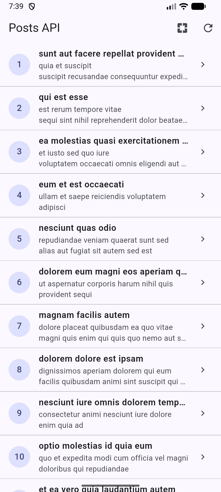
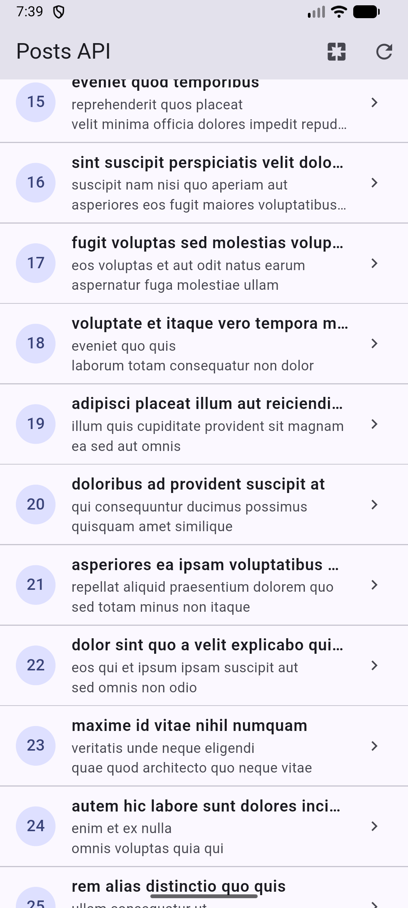
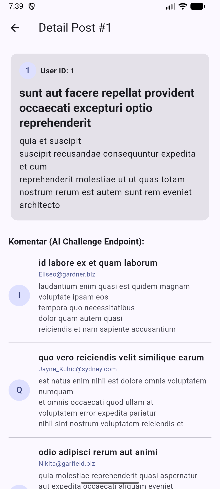
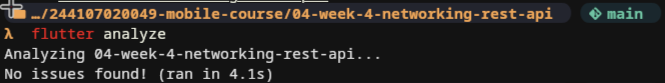
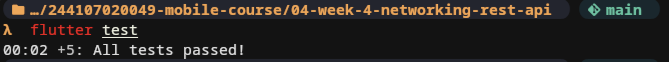

# Minggu 4: Networking & REST API

Dokumentasi dan laporan tugas praktikum Minggu 4 mata kuliah Pemrograman Mobile.

## Identitas Mahasiswa

- **Nama:** Agus Prasetyo
- **NIM:** 244107020049
- **Kelas:** TI-3H
- **Mata Kuliah:** Pemrograman Mobile
- **Program Studi:** D4 Teknik Informatika
- **Jurusan:** Teknologi Informasi

---

## Praktikum 1: Model Data dan Serialization Aman Null

### Deskripsi Implementasi

Pada praktikum pertama, saya membuat model data Dart `Post` untuk memetakan respons JSON dari REST API JSONPlaceholder:

- **Immutability & Konstanta:** Kelas `Post` didefinisikan dengan constructor `const` dan semua field bersifat `final` (`userId`, `id`, `title`, `body`).
- **Pola Parsing Defensif (`fromJson`):** Menggunakan teknik casting aman `(json['userId'] as num?)?.toInt() ?? 0` dan `as String? ?? ''`. Pola ini mencegah terjadinya error fatal `type 'Null' is not a subtype of type 'int'` saat server mengembalikan nilai null, tipe data angka yang tidak sesuai, atau field yang hilang.
- **Serialisasi Data (`toJson`):** Mengubah kembali objek model menjadi `Map<String, dynamic>` untuk kebutuhan pengiriman data.

---

## Praktikum 2: Konfigurasi Dio dan Repository Pattern

### Deskripsi Implementasi

Pada praktikum kedua, saya mengonfigurasi library networking `dio` secara terpusat dan mengisolasi akses jaringan menggunakan Repository Pattern:

- **Konfigurasi Jaringan Terpusat (`lib/data/api_client.dart`):** `Dio` diinisialisasi dengan `BaseOptions` yang memuat base URL `https://jsonplaceholder.typicode.com`, `connectTimeout: 10s`, `receiveTimeout: 10s`, dan header `Accept: application/json`.
- **Logging Jaringan:** Menambahkan `LogInterceptor` agar aktivitas request, status code, dan respons tercatat rapi di console debug.
- **Penerapan Repository Pattern (`lib/data/repositories/post_repository.dart`):** UI dilarang keras memanggil Dio secara langsung. `PostRepository` menjadi satu-satunya gerbang data yang memanggil endpoint `/posts`, mengonversi JSON menjadi `List<Post>`, dan membiarkan exception jaringan naik ke lapisan provider untuk ditangani secara elegan.

---

## Praktikum 3: State Asinkron dengan Riverpod (Loading, Error, Empty, Success)

### Deskripsi Implementasi

Pada praktikum ketiga, saya menghubungkan repository dengan antarmuka pengguna melalui Riverpod `AsyncNotifier` dan `AsyncValue`:

- **`PostListNotifier` & `postListProvider`:** Mewarisi `AsyncNotifier<List<Post>>`. Method `build()` mengeksekusi `repository.fetchPosts()`. Exception teknis dari repository otomatis dibungkus oleh Riverpod menjadi `AsyncError`.
- **Opsi `retry: null`:** Menonaktifkan retry loop otomatis pada provider agar status error bersifat final dan mudah diuji secara deterministik pada unit test.
- **Penanganan Empat State UI (`PostListPage`):**
  - `loading`: Menampilkan `CircularProgressIndicator` di tengah layar saat data sedang diunduh.
  - `error`: Memetakan exception menjadi pesan bahasa Indonesia yang ramah melalui `friendlyErrorMessage` dan menyediakan tombol *Coba lagi* (`ref.invalidate(postListProvider)`).
  - `empty`: Menampilkan pesan informatif jika server mengembalikan list kosong.
  - `data`: Menampilkan daftar postingan di dalam `ListView` dengan `RefreshIndicator` untuk fitur pull-to-refresh.

### Tangkapan Layar

| State Success (Daftar Postingan) | State Error & Tombol Retry |
| :---: | :---: |
|  |  |

---

## Praktikum 4: Pagination dan Infinite Scroll

### Deskripsi Implementasi

Pada praktikum keempat, saya menerapkan mekanisme pagination berbasis *infinite scroll* untuk mengunduh data dalam pecahan halaman kecil:

- **Repository Paginated:** Menambahkan method `fetchPostsPage({required int page, int limit = 10})` yang mengirim query parameter `_page` dan `_limit`.
- **State Halaman (`PagedPostsState`):** Menyimpan `items`, `page`, `isLoadingMore`, `hasMore`, dan `error`.
- **Double-Request Guard (`PagedPostsNotifier`):** Mengecek `if (state.isLoadingMore || !state.hasMore) return;` untuk mencegah duplikasi request saat pengguna menggulir layar dengan cepat dan menghentikan request saat data sudah habis.
- **`ScrollController` Reaktif (`PagedPostPage`):** Listener memicu `loadNextPage()` 200 piksel sebelum pengguna mencapai batas bawah list (`maxScrollExtent - 200`). Di ujung list ditampilkan indikator loading kecil atau teks *Semua data termuat.* jika seluruh data telah diambil.

### Tangkapan Layar

| Pagination Infinite Scroll (Batch Halaman) |
| :---: |
|  |

---

## Tugas Utama: Aplikasi Posts & Komentar REST API

### Deskripsi Implementasi

Aplikasi REST API dikembangkan secara komprehensif dengan menyatukan seluruh materi Codelab Minggu 4:

1. **Konsumsi REST API Terpadu:** Mengonsumsi endpoint `/posts`, query paginasi `?_page=N&_limit=M`, dan endpoint komentar `/comments?postId=id` dari JSONPlaceholder.
2. **Navigasi Terintegrasi dengan GoRouter:**
   - `/`: Halaman utama daftar postingan dengan tombol akses cepat ke mode paginasi dan tombol refresh.
   - `/paged`: Halaman daftar postingan berbasis infinite scroll.
   - `/post/:id`: Halaman detail postingan yang menerima parameter ID dinamis.
3. **Integrasi Komentar AI Challenge:** Halaman detail postingan memuat judul lengkap, konten body, data identitas user, serta daftar komentar asinkron yang dikonsumsi melalui `commentsProvider(postId)`.
4. **Resiliensi Jaringan:** Mendukung transisi mulus saat koneksi internet terputus dan pulih kembali tanpa menyebabkan aplikasi crash.

### Tangkapan Layar

| Halaman Feed Postingan | Rincian Postingan & Komentar (Detail Page) |
| :---: | :---: |
|  |  |

---

## Refactoring Challenge

### Perubahan yang Dilakukan

1. **Pemisahan Widget Reusable `PostTile`:**
   - Baris item postingan diekstrak ke dalam berkas mandiri `lib/widgets/post_tile.dart`.
   - Menampilkan avatar nomor ID, judul dengan teks tebal dan pemotongan satu baris (`TextOverflow.ellipsis`), cuplikan isi dua baris, serta callback `onTap`.
   - Mengurangi kompleksitas kode pada `ListView.builder` di halaman list maupun paged.
2. **Pemusatan Logika Pemetaan Error (`network_errors.dart`):**
   - Fungsi `friendlyErrorMessage(Object error)` dipisahkan ke berkas `lib/data/network_errors.dart`.
   - Memetakan secara spesifik `connectionTimeout`, `receiveTimeout`, `connectionError`, status 404, status 401/403, dan status 500 ke bahasa yang mudah dipahami pengguna.
   - Fungsi ini diekspor dan dipakai ulang di `PostListPage`, `PagedPostPage`, dan `PostDetailPage`.
3. **Navigasi Deklaratif GoRouter & Halaman Detail (`/post/:id`):**
   - Mengonfigurasi `lib/router/app_router.dart` dengan route `/post/:id` yang memanggil `PostDetailPage`.
   - Provider `postDetailProvider` terlebih dahulu memeriksa cache list lokal sebelum memutuskan melakukan request HTTP langsung ke repository.
4. **Kerapian Kode & Standar Linter (`flutter analyze`):**
   - Dilakukan verifikasi statis kode, menghasilkan **0 issues / warnings** (`No issues found!`).



---

## Testing

### Pengujian Kode yang Diterapkan

Sesuai instruksi dan panduan codelab Minggu 4, pengujian difokuskan pada pengujian unit terisolasi tanpa koneksi internet sungguhan:

1. **Unit Test Model & Deserialization (`test/post_test.dart`):**
   - Menguji parsing `Post.fromJson` dan `Comment.fromJson` dengan missing field untuk memastikan nilai default terpasang dengan benar.
   - Menguji keandalan parsing terhadap nilai null dan konversi tipe angka.
2. **Unit Test Pemetaan Error Jaringan (`test/post_test.dart`):**
   - Menguji fungsi `friendlyErrorMessage` terhadap berbagai tipe `DioExceptionType` (koneksi terputus, timeout, dan status error HTTP 404 & 500).
3. **Unit Test Provider dengan Fake Repository (`FakePostRepository`):**
   - Menguji skenario emisi data sukses menggunakan helper `readPostsOnce`.
   - Menguji skenario emisi error menggunakan helper `readPostsErrorOnce`.

Hasil eksekusi `flutter test` menunjukkan seluruh test case lulus dengan sempurna (**All tests passed!**):



---

## Checklist Verifikasi

- [x] UI tidak memanggil Dio langsung, semua akses data melalui repository layer dan Riverpod provider.
- [x] Empat state tampil dengan benar: loading, error (+ retry), empty, dan success.
- [x] Pagination berjalan lancar: data bertambah saat scroll, tidak ada request ganda, dan terdapat indikator akhir data.
- [x] `flutter analyze` bersih tanpa warning atau issue.
- [x] Seluruh unit test pada `test/post_test.dart` lulus 100% tanpa melakukan request HTTP sungguhan.
- [x] Hasil keluaran AI Challenge telah diverifikasi, diperbaiki, dan didokumentasikan di `docs/ai_challenge.md`.

---

## AI Prompt Challenge

Dokumentasi lengkap disimpan pada berkas [docs/ai_challenge.md](docs/ai_challenge.md).

### Prompt yang Diajukan

```text
Buatkan repository layer Flutter untuk endpoint GET /comments?postId={id} dari JSONPlaceholder menggunakan Dio + flutter_riverpod. Requirements:
- Model Comment dengan fromJson aman null (postId, id, name, email, body).
- CommentRepository dengan method fetchComments(postId) + timeout 10 detik.
- AsyncNotifierProvider dengan penanganan error otomatis (AsyncError) dan fungsi pesan error ramah pengguna untuk timeout, connection error, 404, dan 500.
- Satu unit test untuk fromJson dengan field yang hilang.
Jelaskan setiap bagian kode dalam komentar.
```

### AI Verification Checklist

| No | Poin Pemeriksaan | Hasil Evaluasi | Analisis & Tindakan Perbaikan |
|:---:|:---|:---:|:---|
| 1 | UI tidak memanggil Dio langsung | **Lolos** | Akses data dibungkus di dalam repository class, bukan dipanggil langsung dari widget. |
| 2 | fromJson aman terhadap null & missing fields | **Diperbaiki** | Output awal AI menggunakan `as int` mentah yang rentan crash. Diperbaiki dengan `(json['id'] as num?)?.toInt() ?? 0` dan fallback default. |
| 3 | Semua tipe DioException dipetakan ke pesan ramah | **Diperbaiki** | AI belum memetakan kode status 404, 500, dan timeout secara modular. Diperbaiki dengan mengintegrasikan `friendlyErrorMessage` di `network_errors.dart`. |
| 4 | Base URL dan timeout terpusat di satu client | **Diperbaiki** | AI menginisialisasi instance Dio baru di dalam repository. Diperbaiki dengan constructor injection `CommentRepository(this._dio)` terhubung ke `dioProvider`. |
| 5 | Test menguji kasus field yang hilang | **Lolos** | Ditambahkan pengujian unit test pada `test/post_test.dart` untuk memverifikasi missing field pada objek `Comment`. |
| 6 | Lolos `flutter analyze` dan `flutter test` | **Lolos** | Seluruh kode lolos verifikasi linter dan unit test tanpa issue. |

---

## Refleksi

### 1. Mengapa UI dilarang memanggil Dio langsung? Apa yang rusak jika aturan ini dilanggar?

Pelarangan UI memanggil Dio secara langsung merupakan penerapan prinsip *Separation of Concerns* (SoC) dan fondasi arsitektur perangkat lunak yang bersih:
- **Pelanggaran Tanggung Jawab Tunggal (Single Responsibility Principle):** Widget UI bertugas mendeskripsikan tampilan antarmuka dan merespons interaksi pengguna. Jika widget juga mengelola URL endpoint, query parameter, header HTTP, dan parsing data, kode menjadi sangat panjang, padat, dan sulit dipelihara.
- **Kerapuhan saat Perubahan API (*Fragility*):** Jika endpoint URL, format query, atau skema data di sisi backend berubah, pengembang harus mengubah banyak file widget di seluruh aplikasi. Dengan Repository Pattern, perubahan hanya terisolasi di satu berkas repository.
- **Ketidakmampuan Menjalankan Unit Test Terisolasi (*Untestable UI*):** Widget yang memanggil Dio secara langsung tidak dapat diuji tanpa koneksi internet aktif. Repository layer memungkinkan kita melakukan dependency injection dan menyediakan mock/fake repository saat pengujian otomatis.
- **Inkonsistensi Penanganan Kesalahan:** UI akan dibebani keharusan menangani `DioException` secara manual di setiap callback. Jika terlewat, exception yang tidak tertangani akan memicu crash fatal pada aplikasi.

### 2. Kapan pagination client-side cukup, dan kapan harus mengandalkan pagination server (_page/_limit)?

- **Pagination Client-side:**
  - Cukup digunakan apabila total dataset berukuran kecil dan terbatas (misalnya di bawah 100 data atau total ukuran payload kurang dari 100 KB).
  - Sangat ideal untuk data yang jarang berubah dan memerlukan fitur sorting atau filtering multi-kolom instan di memori lokal tanpa jeda latensi jaringan.
- **Pagination Server-side (`_page`/`_limit`):**
  - Wajib digunakan apabila volume data berjumlah ratusan, ribuan, hingga tak terbatas (seperti linimasa media sosial, e-commerce, atau catatan transaksi log).
  - Menghemat kuota bandwidth pengguna secara signifikan karena hanya mengunduh data yang sedang ditampilkan di layar.
  - Menjaga konsumsi memori RAM perangkat mobile tetap rendah dan mencegah frame drop (jank) akibat parsing JSON dalam ukuran raksasa.
  - Mempercepat waktu pemuatan awal aplikasi (*Initial Page Load Time*) secara drastis.

### 3. Bagaimana exception repository berubah menjadi AsyncError tanpa try/catch di setiap widget? Kapan try/catch eksplisit tetap dibutuhkan?

- **Transformasi Otomatis ke `AsyncError`:**
  - Di dalam Riverpod, method `build()` pada `AsyncNotifier` mengembalikan objek `Future<T>`. Jika terjadi exception pada pemanggilan repository di dalam `build()`, framework Riverpod secara internal menangkap unhandled exception tersebut dan mengubah state notifier menjadi `AsyncError(error, stackTrace)`.
  - Di lapisan UI, widget cukup menggunakan pattern matching `asyncValue.when(loading: ..., error: ..., data: ...)`. Hal ini menghilangkan kebutuhan penulisan blok try/catch yang berulang pada widget tree.
- **Kapan Try/Catch Eksplisit Tetap Dibutuhkan:**
  - Pada method aksi/mutasi mutatif (side-effects) seperti `refresh()`, `loadNextPage()`, atau operasi POST/DELETE, di mana kita ingin mempertahankan data lama di memori saat terjadi kegagalan jaringan, alih-alih menghapus data yang sudah ada di layar.
  - Di dalam repository layer itu sendiri ketika kita perlu memetakan status HTTP tertentu menjadi domain exception kustom sebelum diteruskan ke lapisan provider.

### 4. Bagian mana dari hasil AI yang Anda perbaiki, dan mengapa?

Berdasarkan evaluasi terhadap output awal AI pada AI Prompt Challenge:
1. **Casting Numerik pada `fromJson`:**
   - *Hasil AI:* Menggunakan `json['id'] as int` dan `json['postId'] as int`.
   - *Perbaikan:* Diubah menjadi `(json['id'] as num?)?.toInt() ?? 0`.
   - *Alasan:* JSON parser sering menerima angka desimal (double) atau bernilai null saat data tidak lengkap. Casting langsung `as int` adalah penyebab crash tipe data paling umum di Flutter.
2. **Pemusatan Konfigurasi Dio Client:**
   - *Hasil AI:* Menginisialisasi instance Dio baru di dalam repository (`final Dio dio = Dio(...)`).
   - *Perbaikan:* Menerapkan dependency injection melalui constructor `CommentRepository(this._dio)` yang tersambung ke `dioProvider` dan konfigurasi terpusat `api_client.dart`.
   - *Alasan:* Menjamin seluruh request menggunakan timeout, base URL, dan logging interceptor yang sama, serta memudahkan mock repository saat testing.
3. **Pemisahan Pemetaan Pesan Kesalahan:**
   - *Hasil AI:* Logika error handling digabung di dalam file provider atau tidak menangani variasi kode status secara terstruktur.
   - *Perbaikan:* Memindahkan fungsi `friendlyErrorMessage` ke `network_errors.dart` yang memetakan timeout, koneksi terputus, 404, 401/403, dan 500 secara spesifik.
   - *Alasan:* Pengguna tidak boleh melihat error teknis mentah (seperti socket exception atau kode HTTP mentah), melainkan pesan bahasa Indonesia yang mudah dipahami dengan instruksi solusi yang jelas.
