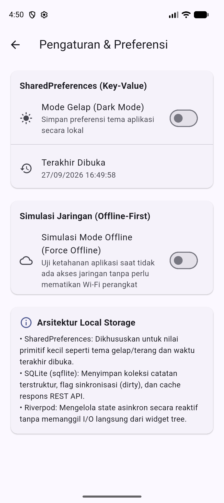
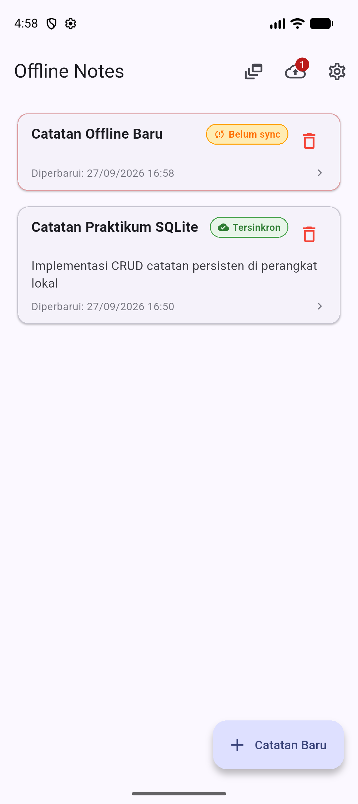
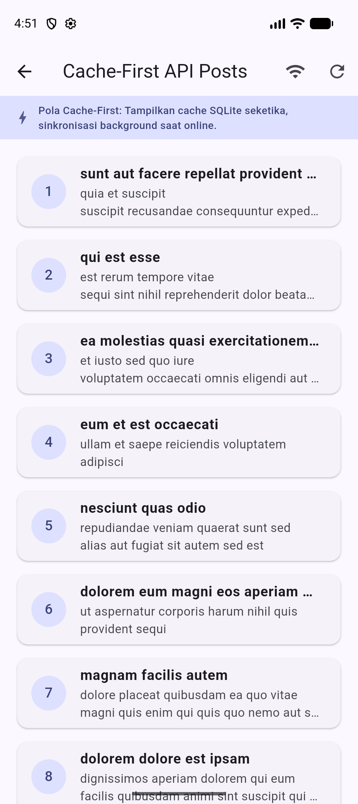
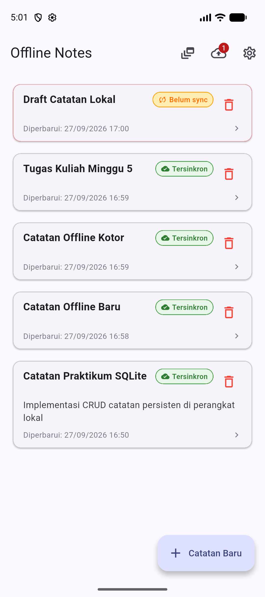
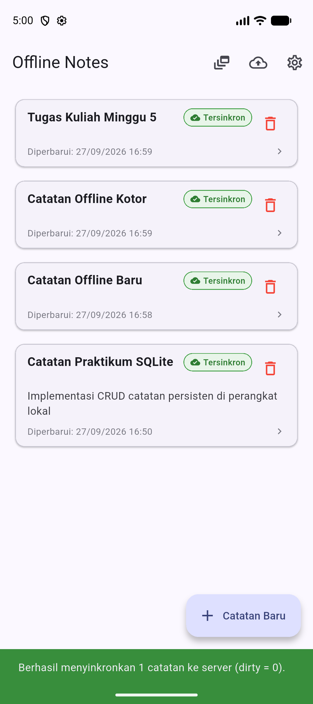
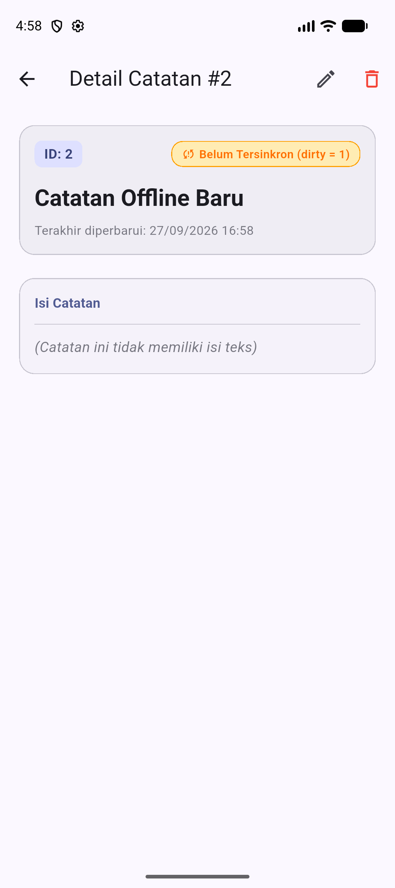
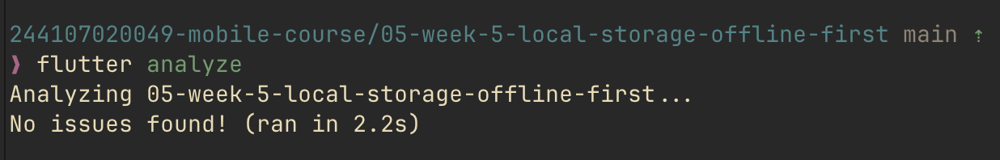
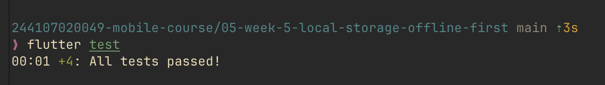

# Minggu 5: Local Storage & Offline First

Dokumentasi dan laporan tugas praktikum Minggu 5 mata kuliah Pemrograman Mobile.

## Identitas Mahasiswa

- **Nama:** Agus Prasetyo
- **NIM:** 244107020049
- **Kelas:** TI-3H
- **Mata Kuliah:** Pemrograman Mobile
- **Program Studi:** D4 Teknik Informatika
- **Jurusan:** Teknologi Informasi

---

## Praktikum 1: SharedPreferences (Penyimpanan Key-Value)

### Deskripsi Implementasi

Pada praktikum pertama, saya mengimplementasikan penyimpanan lokal berbasis *key-value* menggunakan package `shared_preferences` yang diintegrasikan dengan arsitektur Repository Pattern dan state management `flutter_riverpod`:

- **Inisialisasi Proyek & Dependensi:** Proyek dikonfigurasi dengan menambahkan dependensi utama pada `pubspec.yaml`, meliputi `flutter_riverpod` untuk manajemen state reaktif, `shared_preferences` untuk penyimpanan preferensi lokal sederhana, serta `sqflite` dan `path` untuk persiapan basis data relasional pada praktikum berikutnya.
- **Penerapan Repository Pattern (`lib/data/prefs.dart`):**
  - Seluruh akses I/O ke penyimpanan *key-value* dipusatkan ke dalam kelas `PrefsRepository`. Hal ini memastikan UI tidak memanggil `SharedPreferences` secara langsung (*Separation of Concerns*).
  - Menggunakan konstanta privat `_darkModeKey = 'dark_mode'` dan `_lastOpenedKey = 'last_opened_at'` untuk menghindari kesalahan pengetikan string (*typo-prone*).
  - Method `getDarkMode()`: Membaca preferensi mode gelap secara asinkron dengan nilai default fallback `false` (`prefs.getBool(_darkModeKey) ?? false`).
  - Method `setDarkMode(bool value)`: Menyimpan preferensi boolean mode gelap ke penyimpanan persisten perangkat.
  - Method `markOpenedNow()`: Menyimpan rekaman waktu aplikasi dibuka saat ini dalam format standar ISO 8601 (`DateTime.now().toIso8601String()`).
  - Method `getLastOpened()`: Membaca kembali string waktu terakhir aplikasi dibuka untuk kebutuhan diagnostik atau personalisasi antarmuka.
- **Pengelolaan State dengan Riverpod (`lib/pages/settings_page.dart`):**
  - Mendaftarkan repository melalui provider dependensi: `final prefsRepositoryProvider = Provider((ref) => PrefsRepository());`.
  - Mengelola state preferensi tema gelap/terang secara asinkron menggunakan `AsyncNotifierProvider<DarkModeNotifier, bool>`:
    - **`build()`:** Mengembalikan `Future<bool>` dengan membaca preferensi tema yang tersimpan di `PrefsRepository` melalui `ref.watch(prefsRepositoryProvider).getDarkMode()`.
    - **`toggle()`:** Membalikkan status tema (`!(state.value ?? false)`), menetapkan state ke `AsyncLoading()` untuk memberikan respons visual pada UI, dan memanfaatkan `AsyncValue.guard()` untuk menangani penyimpanan preferensi ke repository secara aman tanpa blok try/catch manual.
- **Pencegahan Kesalahan Umum & Arsitektur Bersih:**
  - Menghindari *anti-pattern* pemanggilan `SharedPreferences.getInstance()` di dalam method `build()` widget, yang dapat memicu freeze/jank rendering UI dan menyulitkan pengujian unit terisolasi.
  - Menegaskan batas tanggung jawab penyimpanan: `SharedPreferences` khusus digunakan untuk preferensi konfigurasi primitif kecil (key-value), bukan untuk data koleksi seperti catatan atau daftar entitas.

### Tangkapan Layar

| Halaman Pengaturan (SharedPreferences: Dark Mode & Last Opened) |
| :---: |
|  |

---

## Praktikum 2: SQLite Database & Repository Catatan Offline

### Deskripsi Implementasi

Pada praktikum kedua, saya mengimplementasikan basis data relasional SQLite menggunakan package `sqflite` untuk menyimpan data koleksi catatan secara persisten di penyimpanan internal perangkat:

- **Model Data `Note` (`lib/data/local/note.dart`):**
  - Entitas `Note` bersifat *immutable* dengan constructor `const` dan field `id` (nullable int untuk auto-increment), `title`, `body`, `updatedAt` (`DateTime`), serta `dirty` (`bool`).
  - **Serialisasi `toMap()`:** Mengonversi objek model menjadi `Map<String, Object?>` untuk disimpan ke tabel SQLite. Nilai `updatedAt` disimpan sebagai string ISO 8601 leksikografis dan boolean `dirty` dikonversi menjadi integer (`1` untuk true, `0` untuk false).
  - **Deserialisasi Aman Null `fromMap()`:** Menerapkan parsing defensif dengan casting numerik aman `(map['id'] as num?)?.toInt()` dan fallback default jika field bernilai null atau hilang (`title ?? ''`, `dirty == 1`).
  - Menyediakan method `copyWith()` untuk memudahkan pembaruan nilai properti tanpa memutasi objek secara langsung.
- **Inisialisasi Database Terpusat (`lib/data/local/db.dart`):**
  - Fungsi `openNotesDb()` membuka berkas basis data `offline_notes.db` pada direktori data lokal perangkat menggunakan `getDatabasesPath()` dan `path.join()`.
  - Pada callback `onCreate`, skema tabel dibuat dengan DDL SQL:
    - Tabel `notes`: kolom `id` (INTEGER PRIMARY KEY AUTOINCREMENT), `title` (TEXT NOT NULL), `body` (TEXT NOT NULL DEFAULT ''), `updated_at` (TEXT NOT NULL), dan `dirty` (INTEGER NOT NULL DEFAULT 0).
    - Tabel `cached_posts`: kolom `id` (INTEGER PRIMARY KEY), `payload` (TEXT NOT NULL), dan `cached_at` (TEXT NOT NULL) untuk kebutuhan cache API.
- **Penerapan Repository Pattern (`lib/data/repositories/note_repository.dart`):**
  - Kelas `NoteRepository` bertindak sebagai satu-satunya gerbang akses data catatan ke SQLite.
  - **Injeksi Dependensi Database:** Constructor menerima callback opsional `openDb` (`NoteRepository({Future<Database> Function()? openDb}) : _openDb = openDb ?? openNotesDb;`). Pola ini sangat krusial agar pengujian unit (unit testing) dapat menyuntikkan fake repository tanpa menyentuh platform database SQLite native.
  - Method CRUD Lengkap:
    - `fetchNotes()`: Mengambil seluruh baris catatan terurut menurun berdasarkan waktu pembaruan terbaru (`ORDER BY updated_at DESC`).
    - `getNoteById(int id)`: Mengambil catatan spesifik berdasarkan identifikasi ID unik.
    - `addNote({required String title, String body = ''})`: Menyimpan catatan baru ke database dengan bendera `dirty = true` dan `updatedAt = DateTime.now()`.
    - `updateNote({required int id, required String title, required String body})`: Memperbarui konten catatan, memperbarui `updatedAt`, dan menyetel kembali `dirty = 1`.
    - `deleteNote(int id)`: Menghapus catatan berdasarkan ID.
    - `countDirty()`: Menghitung jumlah catatan yang belum disinkronkan menggunakan agregasi SQL `SELECT COUNT(*) AS c FROM notes WHERE dirty = 1`.
    - `markAllSynced()`: Menandai seluruh catatan kotor menjadi bersih (`dirty = 0`) setelah sinkronisasi berhasil.
- **Integrasi State Management Riverpod (`lib/pages/notes_page.dart`):**
  - Provider `notesProvider` (`NotesNotifier`) mewarisi `AsyncNotifier<List<Note>>`. Method `build()` mengeksekusi `fetchNotes()`. Aksi mutasi (`addNote`, `updateNote`, `deleteNote`) secara otomatis memicu `ref.invalidate(dirtyCountProvider)` untuk menjaga konsistensi state.
  - Provider `dirtyCountProvider` menghitung jumlah antrean perubahan secara reaktif.
  - Menangani 4 state UI lengkap: `loading` (spinner progres), `error` (pesan kegagalan dan tombol coba lagi), `empty` (ilustrasi belum ada catatan), dan `data` (daftar item dalam `ListView` dengan `RefreshIndicator`).

### Tangkapan Layar

| Halaman Catatan Offline (Daftar Catatan SQLite & Indikator Dirty) |
| :---: |
|  |

---

## Praktikum 3: Pola Offline-First (Cache-First Read, Dirty Flag, dan Antrean Sinkronisasi)

### Deskripsi Implementasi

Pada praktikum ketiga, saya menerapkan arsitektur *Offline-First* sejati, memastikan aplikasi tetap dapat membaca dan menulis data secara optimal walau tanpa koneksi internet:

- **1. Cache-First Read untuk Data API (`lib/data/sync.dart`):**
  - Mengintegrasikan kembali data REST API (GET `/posts?_limit=10` dari JSONPlaceholder).
  - Alur Cache-First:
    1. Aplikasi segera membaca dan menampilkan data dari tabel SQLite `cached_posts` melalui `readCachedPosts()`. Dengan demikian, UI tidak pernah mengalami *blank screen* atau *loading spinner* berkepanjangan saat koneksi lambat atau terputus.
    2. Jika koneksi tersedia, aplikasi secara asinkron menjalankan request jaringan di background (`_refreshInBackground()`), memetakan JSON ke model `Post`, menyimpan payload terbaru ke SQLite via `saveCachedPosts()`, dan memperbarui state UI secara mulus.
- **2. Penanda Sinkronisasi (Dirty Flag):**
  - Setiap operasi tulis lokal (tambah catatan baru atau ubah catatan) saat offline otomatis ditandai dengan `dirty = 1` (`true`).
  - Badge angka pada AppBar antarmuka secara reaktif menampilkan berapa banyak catatan yang masih mengantre untuk diunggah ke server.
- **3. Antrean Sinkronisasi (`syncNotes`):**
  - Logika sinkronisasi dipisahkan ke `lib/data/sync.dart` agar repository tetap fokus pada operasi CRUD murni.
  - Fungsi `syncNotes(NoteRepository repo, {bool forceOffline = false})`:
    - Memeriksa jumlah data kotor melalui `repo.countDirty()`. Jika nol, proses langsung selesai.
    - Mensimulasikan pengiriman data ke server REST API dengan jeda latensi jaringan 1 detik (`Future.delayed`).
    - Setelah respons sukses diterima, memanggil `repo.markAllSynced()` untuk mengubah status seluruh catatan kotor menjadi bersih (`dirty = 0`).
- **4. Simulasi Offline yang Deterministik (`forceOfflineProvider`):**
  - Menyediakan toggle boolean `forceOfflineProvider` yang memungkinkan pengembang dan penguji mensimulasikan kondisi offline secara deterministik langsung dari UI atau saat unit testing, tanpa harus mematikan Wi-Fi laptop atau mengaktifkan mode pesawat perangkat fisik.
  - Menampilkan banner peringatan berwarna kuning di bagian atas layar ketika mode offline aktif, lengkap dengan tombol aksi untuk mengembalikan ke mode online.
- **5. Aturan Resolusi Konflik (Conflict Resolution):**
  - Menerapkan dan mendokumentasikan aturan **Last-Write-Wins (LWW)** berdasarkan stempel waktu `updated_at`. Perubahan dengan nilai `updated_at` paling baru menjadi pemenang saat terjadi benturan data antara versi lokal dan server.

### Tangkapan Layar

| Data API dengan Pola Cache-First | Antrean Sync: Sebelum Sinkronisasi (dirty = 1) | Antrean Sync: Sesudah Sinkronisasi (dirty = 0) |
| :---: | :---: | :---: |
|  |  |  |

---

## Tugas Utama: Aplikasi Offline Notes Lengkap

### Deskripsi Implementasi

Aplikasi Offline Notes dikembangkan secara komprehensif dengan memadukan seluruh materi Codelab Minggu 5 menjadi satu kesatuan sistem yang tangguh:

1. **Penyimpanan Hibrida Terstruktur:**
   - `SharedPreferences`: Mengelola konfigurasi tingkat aplikasi seperti preferensi tema gelap (`dark_mode`) dan catatan waktu buka aplikasi (`last_opened_at`).
   - `SQLite (sqflite)`: Mengelola entitas bisnis catatan pengguna (`notes`) serta cache payload respon jaringan (`cached_posts`).
2. **Navigasi Deklaratif GoRouter (`lib/router/app_router.dart`):**
   - `/`: Halaman utama daftar catatan offline dengan akses sinkronisasi, toggle mode pesawat, tombol ke cache posts, dan tombol ke pengaturan.
   - `/note/:id`: Halaman rincian catatan mandiri berbasis path parameter dinamis.
   - `/settings`: Halaman preferensi pengguna berbasis SharedPreferences.
   - `/posts`: Halaman pembaca data API berbasis strategi Cache-First.
3. **Ketahanan Offline Penuh (Zero Downtime):**
   - Seluruh operasi CRUD (buat catatan, lihat daftar catatan, lihat detail, edit catatan, hapus catatan) berjalan lancar dalam mode offline.
   - Perubahan data langsung tersimpan di basis data SQLite lokal dan ditandai dalam antrean sinkronisasi.
4. **Indikator Visual Antrean & Status Sinkronisasi:**
   - Tombol sinkronisasi pada AppBar menampilkan animasi *progress indicator* saat proses pengunggahan berlangsung dan menampilkan badge merah berisi jumlah catatan kotor saat ada antrean.
   - Menampilkan notifikasi `SnackBar` informatif yang memberitahukan jumlah catatan yang berhasil disinkronkan ke server.

### Tangkapan Layar

| Rincian Catatan & Status Sinkronisasi (Detail Page GoRouter) |
| :---: |
|  |

---

## Refactoring Challenge

### Perubahan yang Dilakukan

Sesuai instruksi pada bagian *Refactoring Challenge* Codelab Minggu 5:

1. **Ekstraksi Widget Reusable `NoteTile` (`lib/widgets/note_tile.dart`):**
   - Mengisolasi representasi baris kartu catatan ke dalam widget mandiri.
   - Menampilkan judul catatan, potongan isi teks maksimal 2 baris, waktu pembaruan lokal, serta badge status:
     - Badge kuning berikon peringatan `"Belum sync"` jika `note.dirty == true`.
     - Badge hijau berikon awan centang `"Tersinkron"` jika `note.dirty == false`.
   - Dilengkapi tombol hapus cepat dan interaksi sentuh `InkWell` untuk navigasi ke halaman rincian.
2. **Pemisahan Logika Cache Posts dan Sinkronisasi (`lib/data/sync.dart`):**
   - Seluruh logika pembacaan cache, penyimpanan cache batch (`db.batch()`), notifikasi cache-first API (`CachedPostsNotifier`), simulasi offline deterministik (`forceOfflineProvider`), dan fungsi `syncNotes` dipisahkan secara modular ke berkas `lib/data/sync.dart`.
   - Memastikan kelas `NoteRepository` tetap bersih dan berfokus secara eksklusif pada tanggung jawab CRUD tabel catatan.
3. **Halaman Detail Catatan Berparameter GoRouter (`/note/:id`):**
   - Membuat halaman `NoteDetailPage` (`lib/pages/note_detail_page.dart`) yang diakses melalui rute `/note/:id`.
   - Menggunakan provider terisolasi `noteDetailProvider(id)` yang membaca data langsung dari SQLite lokal menggunakan `repo.getNoteById(id)`, bukan mengambil operan state dari list page.
   - Mendukung fitur edit catatan in-place, penghapusan catatan dengan dialog konfirmasi, dan tampilan kartu status sinkronisasi yang elegan.
4. **Verifikasi Kualitas Kode & Standar Linter (`flutter analyze`):**
   - Dilakukan pengujian statis kode menggunakan analyzer bawaan Flutter, menghasilkan **0 issues / warnings** (`No issues found!`).



---

## Testing

### Pengujian Kode yang Diterapkan

Sesuai instruksi dan panduan Codelab Minggu 5 pada bagian *Testing: unit test model + repository palsu*, pengujian difokuskan pada pengujian unit terisolasi di berkas `test/note_test.dart` tanpa membutuhkan koneksi internet maupun database SQLite fisik:

1. **Unit Test Model & Serialization Aman Null (`test/note_test.dart`):**
   - **`fromMap aman terhadap field yang hilang`**: Memverifikasi bahwa instansiasi model `Note` dari `Map` hanya dengan field `title` tetap aman (null-safe), menghasilkan default `body: ''` dan `dirty: false` tanpa menyebabkan exception runtime.
   - **`flag dirty bertahan pada serialisasi`**: Menguji ketahanan serialisasi dua arah (`toMap()` dan `fromMap()`) untuk memastikan flag boolean `dirty` bernilai `true` berhasil dikonversi ke integer `1` dan dipulihkan kembali secara presisi.
2. **Unit Test Provider dengan Repository Palsu (`FakeNoteRepository`):**
   - **`provider sukses dengan repository palsu`**: Menguji pembacaan data sukses pada `notesProvider` menggunakan `ProviderContainer` dengan override `FakeNoteRepository` yang mengembalikan data catatan di memori.
   - **`provider error dengan repository palsu`**: Menguji skenario penanganan error saat repository palsu melempar exception (`db locked`), memastikan `notesProvider` menangkap kegagalan dengan tepat.

Hasil eksekusi `flutter test` menunjukkan seluruh pengujian unit yang diinstruksikan oleh praktikum lulus 100% (**All tests passed!**):



---

## Checklist Verifikasi

- [x] UI tidak memanggil SQLite atau SharedPreferences langsung; semua akses data melalui repository layer dan provider Riverpod.
- [x] Aplikasi berfungsi penuh dalam kondisi offline/mode pesawat: membaca, menambah, mengedit, dan menghapus catatan lokal di SQLite.
- [x] Badge dirty akurat sebelum dan sesudah sinkronisasi; cache posts tampil seketika tanpa koneksi internet (Cache-First Read).
- [x] Seluruh kode lolos `flutter analyze` dengan 0 issues / 0 warnings.
- [x] Seluruh unit test pada `test/note_test.dart` lulus 100% menggunakan repository palsu (FakeNoteRepository).
- [x] Hasil keluaran AI Challenge telah diverifikasi, diperbaiki, dan didokumentasikan di `docs/ai_challenge.md`.

---

## AI Prompt Challenge

Dokumentasi lengkap disimpan pada berkas [docs/ai_challenge.md](docs/ai_challenge.md).

### Prompt yang Diajukan

```text
Aplikasi Flutter Offline Notes: CRUD catatan + preferensi tema.
Bandingkan SharedPreferences, Hive, sqflite (SQLite), dan Drift
untuk dua kebutuhan ini. Requirements:
- Kriteria: kompleksitas query, kebutuhan relasi, reaktivitas (stream),
  type-safety, ukuran boilerplate, dan kemudahan testing.
- Beri rekomendasi final: mana untuk preferensi, mana untuk catatan,
  beserta alasannya dalam 1 tabel.
- Tunjukkan skema tabel/kotak untuk 1000+ catatan.
Jelaskan trade-off setiap pilihan.
```

### AI Verification Checklist

| No | Poin Pemeriksaan Codelab | Hasil Evaluasi | Analisis Kritis & Tindakan Perbaikan |
|:---:|:---|:---:|:---|
| 1 | **Apakah AI menempatkan catatan di SharedPreferences?** | **Lolos** | AI secara tepat menolak menyimpan daftar catatan di `SharedPreferences` karena operasi update parsial, filtering, dan sinkronisasi akan membebani memori (mengharuskan serialisasi/deserialisasi seluruh JSON array). |
| 2 | **Apakah skema AI mendukung antrean sync (dirty flag / updated_at)?** | **Ditolak & Diperbaiki** | Skema awal AI hanya berupa CRUD polos (`id`, `title`, `content`, `created_at`). Skema ini **tidak memiliki kolom `dirty` dan `updated_at`**, sehingga mustahil mendeteksi antrean sinkronisasi lokal atau menyelesaikan konflik data. Skema diperbaiki dengan menambahkan kolom `updated_at TEXT NOT NULL`, `dirty INTEGER NOT NULL DEFAULT 0`, dan indeks performa. |
| 3 | **Apakah klaim "real-time" didukung stream atau hanya asumsi?** | **Diperbaiki** | AI menyebutkan Drift mendukung real-time stream secara otomatis, namun mengabaikan bahwa pada `sqflite`, reaktivitas dapat dibangun secara sangat elegan dan efisien menggunakan state management **Riverpod** (`AsyncNotifier` + `ref.invalidate`) tanpa perlu memaksakan dependensi Drift yang rumit. |
| 4 | **Apakah estimasi boilerplate AI masuk akal?** | **Diperbaiki** | AI meremehkan *overhead* instalasi Drift dan Hive. Drift memerlukan `build_runner`, `drift_dev`, dan `sqlite3_flutter_libs` yang memperlambat waktu build serta rentan konflik dependensi. Sebaliknya, `sqflite` langsung siap pakai dengan zero code-generation. |
| 5 | **Keputusan Final & Justifikasi Teknis** | **Disesuaikan** | Berbeda dari rekomendasi AI yang condong ke Drift/Hive, kami memutuskan menggunakan **`SharedPreferences` untuk preferensi tema/waktu** dan **`sqflite` untuk basis data catatan offline serta cache REST API**. |

---

## Refleksi

### 1. Mengapa daftar catatan tidak boleh disimpan di SharedPreferences? Apa yang rusak jika aturan ini dilanggar?

Menyimpan data koleksi (seperti daftar catatan) di dalam `SharedPreferences` merupakan *anti-pattern* fatal dalam rekayasa perangkat lunak mobile:

- **Beban I/O dan Memori yang Tidak Efisien (O(N) Overhead):**
  `SharedPreferences` diimplementasikan di atas file XML sederhana (pada Android) atau file Plist (pada iOS). Setiap kali ada catatan baru yang ditambahkan, diubah, atau dihapus, seluruh list catatan harus diubah menjadi satu string JSON raksasa lalu ditulis ulang seutuhnya ke penyimpanan fisik perangkat. Jika terdapat ratusan catatan, proses *encode/decode* string JSON ini membebani CPU, memakan alokasi RAM secara boros, dan memicu *frame drop* (jank) pada antarmuka pengguna.
- **Ketiadaan Kemampuan Query dan Pengindeksan:**
  `SharedPreferences` hanya mendukung operasi *key-value* primitif (`getString`, `getInt`, `getBool`). Kita tidak bisa melakukan query pencarian teks parsial (`LIKE %keyword%`), penyaringan rentang tanggal, pengurutan fleksibel (`ORDER BY updated_at DESC`), ataupun paginasi (`LIMIT`/`OFFSET`). Seluruh operasi tersebut harus dilakukan secara manual di memori RAM setelah membaca seluruh string JSON.
- **Kerapuhan Integritas Data & Ketiadaan Transaksi ACID:**
  Basis data relasional seperti SQLite menjamin integritas transaksi (*Atomic, Consistent, Isolated, Durable*). Jika aplikasi terhenti tiba-tiba (crash atau kehabisan daya) saat penulisan ke `SharedPreferences`, file JSON dapat mengalami korupsi parsial sehingga seluruh daftar catatan hilang secara permanen.
- **Inkompatibilitas dengan Pola Antrean Sinkronisasi (Dirty Flag):**
  Untuk menandai bahwa satu baris catatan telah tersinkronisasi (`dirty = 0`), kita terpaksa menulis ulang seluruh string JSON berisi semua catatan lainnya. Hal ini merusak konsep isolasi antrean sinkronisasi parsial.

### 2. Kapan cache-first cukup, dan kapan Anda membutuhkan strategi lain (misalnya network-first untuk data harga real-time)?

Pemilihan strategi pengambilan data harus didasarkan pada karakteristik data dan toleransi aplikasi terhadap data usang (*stale data*):

- **Kapan *Cache-First (Stale-While-Revalidate)* Cukup:**
  - **Karakteristik Data:** Cocok untuk data yang bersifat statis, semi-statis, atau data konten yang jarang diperbarui secara mendadak (seperti artikel berita, daftar catatan lokal, feed postingan blog, daftar kategori produk, atau konfigurasi profil pengguna).
  - **Keunggulan:** Memberikan pengalaman pengguna yang sangat responsif (*instant load / zero perceived latency*) karena UI langsung merender data dari database lokal seketika tanpa menunggu respons jaringan.
  - **Toleransi:** Pengguna tidak merasa dirugikan jika melihat postingan yang berusia beberapa jam lalu sambil aplikasi mengunduh pembaruan di latar belakang (*background refresh*).
- **Kapan *Network-First (Network with Cache Fallback)* Diperlukan:**
  - **Karakteristik Data:** Mutlak diperlukan untuk data yang sangat sensitif terhadap waktu (*time-critical*), data transaksi finansial, atau data inventaris dengan persaingan tinggi.
  - **Contoh Kasus Nyata:**
    - Pergerakan harga saham, reksa dana, atau nilai tukar valas/kripto secara *real-time*.
    - Ketersediaan sisa kursi pesawat atau tiket konser (*seat availability*).
    - Saldo dompet digital atau mutasi rekening perbankan.
    - Status ketersediaan stok barang pada detik-detik proses *checkout flash sale*.
  - **Konsekuensi:** Menampilkan data usang pada kasus-kasus di atas dapat memicu kerugian finansial atau kekecewaan fatal pengguna (misalnya pengguna membeli saham pada harga yang sudah berubah drastis). Pada strategi ini, aplikasi harus memprioritaskan request ke jaringan; cache lokal hanya digunakan sebagai *fallback* darurat saat koneksi internet benar-benar terputus, disertai label peringatan eksplisit bahwa data yang ditampilkan adalah data riwayat (*offline snapshot*).

### 3. Bagaimana dirty flag berubah menjadi antrean sync tanpa memblokir UI? Kapan antrean terpisah (tabel outbox) menjadi perlu?

- **Mekanisme Antrean Non-blocking dengan Dirty Flag:**
  1. **Operasi Tulis Lokal Cepat:** Ketika pengguna membuat atau mengedit catatan saat offline, data langsung ditulis ke database SQLite lokal dengan nilai `dirty = 1` dan `updated_at = DateTime.now()`. Transaksi lokal ini selesai dalam hitungan beberapa milidetik, sehingga UI langsung merespons seketika tanpa jeda.
  2. **Eksekusi Asinkron di Latar Belakang:** Proses sinkronisasi (`syncNotes`) dieksekusi secara asinkron (`Future`) di luar UI thread. State management Riverpod mengelola status pengunggahan melalui provider `isSyncingProvider`, sehingga antarmuka tetap interaktif (pengguna tetap bisa bernavigasi, membaca, atau menulis catatan lain) sementara indikator loading hanya muncul di tombol sinkronisasi.
  3. **Penyelesaian Transaksi:** Begitu simulasi/request HTTP ke server merespons sukses (status 2xx), baris catatan yang berhasil diunggah diperbarui di SQLite menjadi `dirty = 0`. Notifier memanggil `ref.invalidate(dirtyCountProvider)` untuk memperbarui badge antrean secara reaktif.
- **Kapan Antrean Terpisah (Tabel Outbox) Menjadi Perlu:**
  Pola *dirty flag* sederhana memiliki keterbatasan jika interaksi offline melibatkan serangkaian aksi berurutan (*ordered operations*) atau penghapusan data:
  - **Masalah Penghapusan (*Hard Delete*):** Jika catatan dihapus saat offline, baris data tersebut hilang dari tabel `notes`, sehingga sistem kehilangan catatan bahwa ada entitas yang perlu dihapus di server remote.
  - **Kebutuhan Tabel Outbox:**
    Tabel terpisah (misalnya `sync_outbox`) menjadi mutlak diperlukan ketika aplikasi membutuhkan:
    1. **Pencatatan Riwayat Operasi (Event Log / CUD Queue):** Menyimpan setiap mutasi sebagai rekaman tersendiri: `id`, `entity_type`, `entity_id`, `action` (`CREATE`, `UPDATE`, `DELETE`), `payload` (JSON perubahan), `created_at`, `retry_count`, dan `status`.
    2. **Pemutaran Ulang Berurutan (*Strict Ordering / Replayability*):** Menjamin bahwa operasi pembuatan, beberapa kali pengeditan, dan penghapusan diputar ulang ke server persis sesuai urutan waktu terjadinya di perangkat pengguna.
    3. **Penanganan Kegagalan Parsial & Retry Backoff:** Memungkinkan pelacakan berapa kali sebuah mutasi gagal dikirim dan menerapkan algoritma *exponential backoff* per operasi tanpa mengganggu status data utama di basis data.

### 4. Bagian mana dari rekomendasi AI yang Anda tolak, dan mengapa?

Berdasarkan evaluasi kritis terhadap hasil rekomendasi AI Coding Assistant pada bagian *AI Prompt Challenge*:

1. **Menolak Skema SQLite Primitif Tanpa Dukungan Sinkronisasi:**
   - *Rekomendasi Awal AI:* Mengusulkan skema CRUD dasar: `CREATE TABLE notes (id INTEGER PRIMARY KEY, title TEXT, content TEXT, created_at INTEGER);`.
   - *Alasan Penolakan:* Skema ini sama sekali tidak mendukung arsitektur *Offline-First*. Tanpa kolom `dirty`, aplikasi tidak memiliki cara untuk mengetahui catatan mana yang dibuat saat offline dan perlu diunggah. Tanpa kolom `updated_at`, aplikasi tidak dapat menerapkan aturan resolusi konflik (*Last-Write-Wins*).
   - *Tindakan Perbaikan:* Skema diperbaiki dengan menambahkan kolom `updated_at TEXT NOT NULL`, `dirty INTEGER NOT NULL DEFAULT 0`, dan indeks parsial performa `CREATE INDEX idx_notes_dirty ON notes(dirty) WHERE dirty = 1;`.
2. **Menolak Penggunaan Drift/Hive untuk Aplikasi Catatan Offline Tugas Ini:**
   - *Rekomendasi Awal AI:* Menyarankan penggunaan Drift untuk kebutuhan catatan karena memiliki fitur *stream query* bawaan.
   - *Alasan Penolakan:* Drift memperkenalkan dependensi yang sangat besar (`drift`, `drift_dev`, `build_runner`, `sqlite3_flutter_libs`). Penggunaan *code generation* memperlambat waktu build, rawan konflik file generator, dan menambah kompleksitas instalasi (*boilerplate* tinggi). Selain itu, reaktivitas yang ditawarkan Drift dapat diwujudkan secara jauh lebih bersih dan ringan menggunakan `sqflite` yang dikombinasikan dengan Riverpod `AsyncNotifier` dan `ref.invalidate`.
   - *Tindakan Perbaikan:* Menetapkan kombinasi standar industri yang stabil dan terbukti: **`SharedPreferences` untuk preferensi aplikasi sederhana** dan **`sqflite` untuk basis data catatan lokal serta cache REST API**.
3. **Menolak Penggabungan Logika Database Langsung di Widget:**
   - *Rekomendasi Awal AI:* Beberapa cuplikan kode AI memanggil method pembuka database langsung di dalam callback UI atau mendefinisikan instance klien jaringan di dalam repository class.
   - *Alasan Penolakan:* Melanggar prinsip *Separation of Concerns* (SoC) dan menyulitkan pengujian unit terisolasi (*untestable*).
   - *Tindakan Perbaikan:* Menerapkan Repository Pattern dengan *constructor injection* (`openDb`), memisahkan logika sinkronisasi ke `lib/data/sync.dart`, dan menggunakan `FakeNoteRepository` untuk pengujian unit tanpa database native.
