# Minggu 6: Authentication, Security & FCM

Dokumentasi dan laporan tugas praktikum Minggu 6 mata kuliah Pemrograman Mobile.

## Identitas Mahasiswa

- **Nama:** Agus Prasetyo
- **NIM:** 244107020049
- **Kelas:** TI-3H
- **Mata Kuliah:** Pemrograman Mobile
- **Program Studi:** D4 Teknik Informatika
- **Jurusan:** Teknologi Informasi

---

## Praktikum 1: Authentication dan Secure Storage

### Deskripsi Implementasi

- Login mock sesuai codelab melalui `AuthRepository`, dengan validasi email dan kata sandi minimal 6 karakter. Token mock bukan JWT produksi.
- `TokenStore` menyimpan access dan refresh token hanya di `flutter_secure_storage`.
- `AuthNotifier` membaca sesi tersimpan saat startup, menangani loading/error, login, dan logout.
- GoRouter membatasi akses ke halaman utama dan pengumuman. Tujuan deep link dipertahankan selama login.
- Interceptor Dio menangani 401 dengan satu refresh dan satu retry. Refresh gagal atau retry tetap 401 membersihkan sesi dan mengarahkan ke login.
- `MockCampusAdapter` menyimulasikan API dalam memori untuk demo 401 tanpa backend eksternal; bukan server kampus nyata.

### Tangkapan Layar

| Login | Validasi Input |
| :---: | :---: |
| 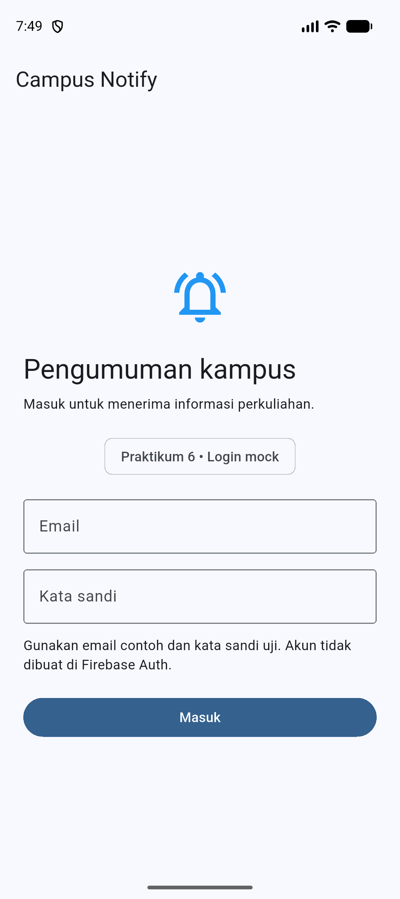 | 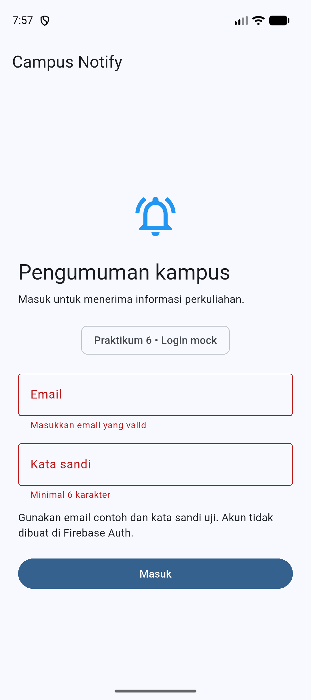 |

| Refresh Berhasil | Refresh Gagal, Kembali ke Login |
| :---: | :---: |
| 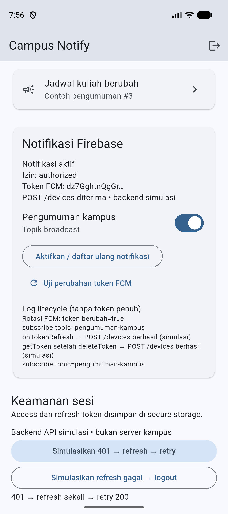 |  |

Login memperlihatkan form mock; validasi memperlihatkan dua pesan kesalahan. Pada refresh berhasil, hasil `401 → refresh sekali → retry 200` terlihat di bawah tombol demo. Gambar refresh gagal adalah kondisi sesudah tombol kegagalan dijalankan: pengguna kembali ke login. Mekanisme penghapusan token diperiksa lewat unit test, karena layar login saja tidak membuktikan isi secure storage.

---

## Praktikum 2: Firebase, Permission, dan Token Lifecycle

### Deskripsi Implementasi

`PushService` meminta permission Android 13+, mengambil token FCM, dan mendaftarkannya melalui `POST /devices`. Listener `onTokenRefresh` memanggil registrasi yang sama. UI hanya menampilkan 12 karakter awal token. Mode default menggunakan adapter backend simulasi; kontrak endpoint produksi akan didokumentasikan di `docs/`.

Firebase dikonfigurasi melalui FlutterFire pada project `campus-notify-244107020049`. Permission, pengambilan token, dan pengiriman pesan FCM nyata sudah diverifikasi di emulator Pixel 10.

### Tangkapan Layar

| Permission Android | Token Sebelum Penghapusan Data |
| :---: | :---: |
| 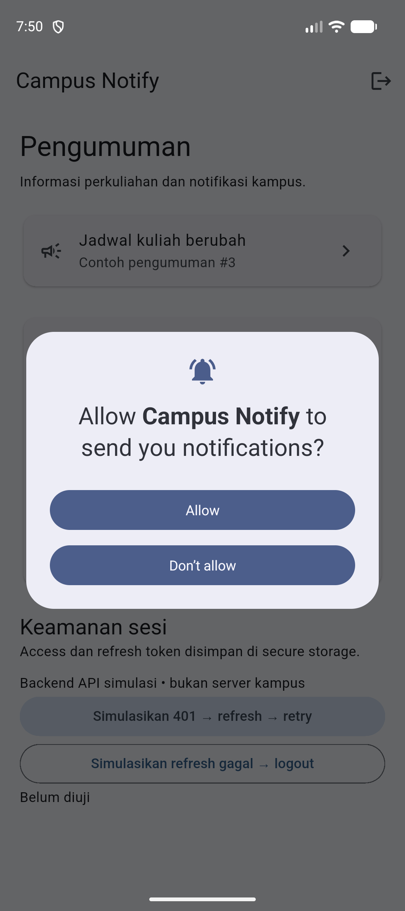 | 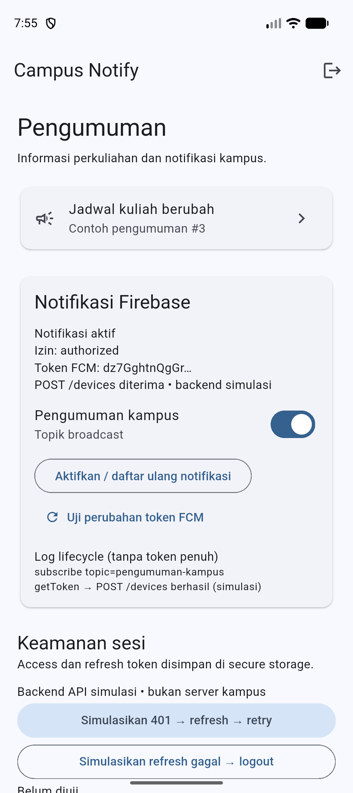 |

| Rotasi dan onTokenRefresh | Login Setelah Clear Data | Token Setelah Clear Data |
| :---: | :---: | :---: |
| 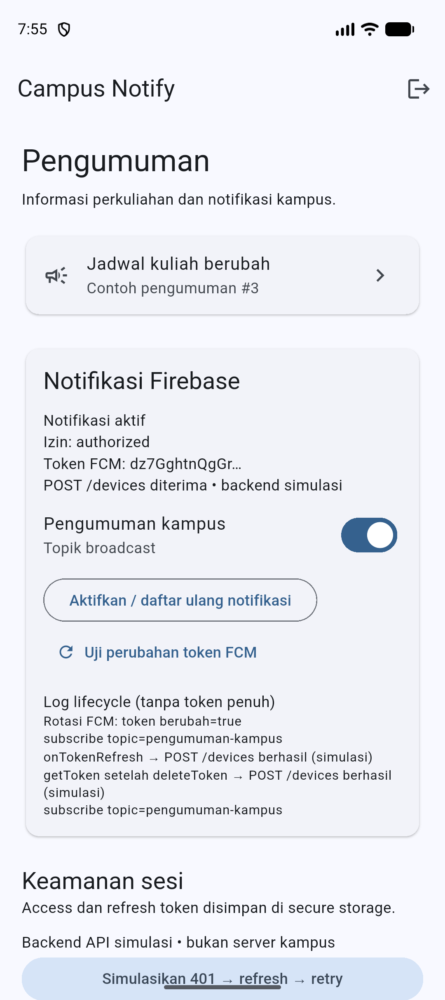 |  | 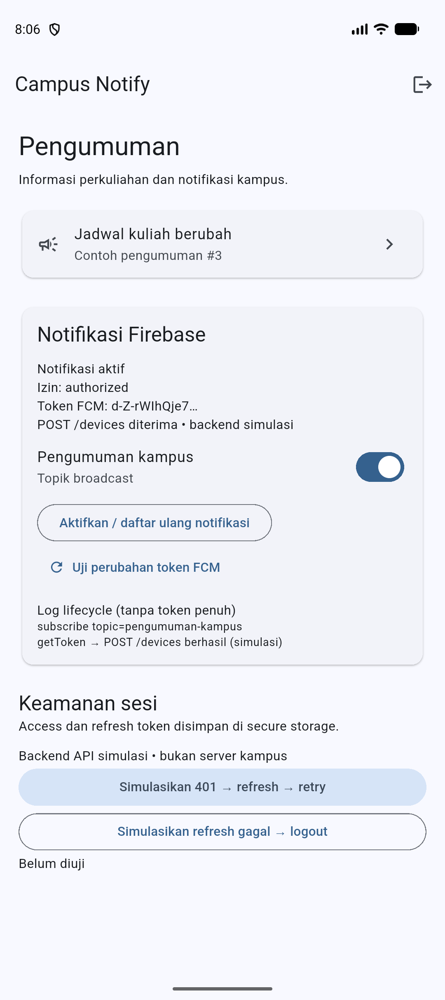 |

Dialog permission membuktikan permintaan izin runtime. Token sebelum dan sesudah clear data dibandingkan melalui prefix; login setelah clear data menunjukkan sesi perlu dibuat kembali. Gambar rotasi menampilkan `token berubah=true` dan callback POST, dengan label backend simulasi.

Rotasi dilakukan melalui `deleteToken` dan `getToken`: log menunjukkan `token berubah=true` serta `onTokenRefresh → POST /devices berhasil (simulasi)`. Setelah `adb shell pm clear id.ac.polinema.campus_notify`, prefix berubah dari `dz7GghtnQgGr…` menjadi `d-Z-rWIhQje7…`; kedua screenshot hanya menampilkan prefix.

### Pengiriman dari Firebase Console

Campaign `Jadwal kuliah berubah` dikirim dari Firebase Console pada project `campus-notify-244107020049`, dengan target Android. Bukti yang diberikan pengguna menunjukkan status **Completed**, notifikasi diterima di emulator saat aplikasi background, dan halaman **Pengumuman #3** dengan tujuan `/pengumuman/3` setelah notifikasi diklik.

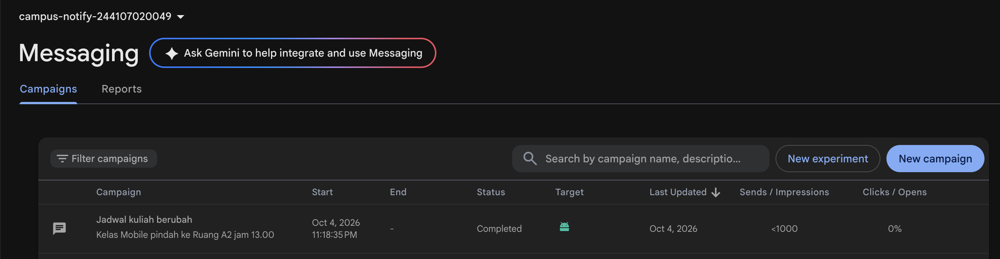

| Notifikasi dari Console | Halaman Setelah Klik |
| :---: | :---: |
| 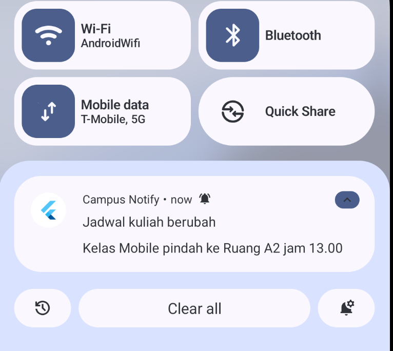 | 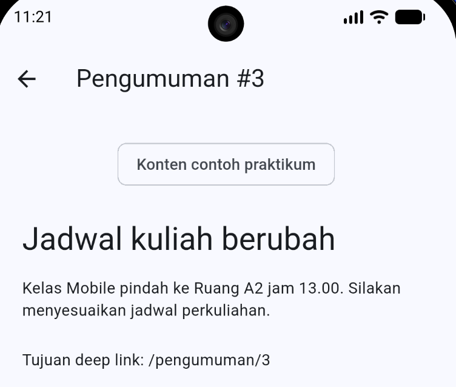 |

---

## Praktikum 3: App State, Deep Link, dan Topic Messaging

### Deskripsi Implementasi

- Foreground: `onMessage` menampilkan local notification untuk payload gabungan; klik meneruskan rute ke GoRouter.
- Background: Android menampilkan notification payload; `onMessageOpenedApp` menangani klik.
- Terminated: `getInitialMessage` dikonsumsi setelah router siap.
- Background handler top-level memakai `@pragma('vm:entry-point')`, tanpa BuildContext atau Riverpod.
- Subscribe/unsubscribe `pengumuman-kampus` dari UI, dan unsubscribe saat sesi logout.
- Data-only dicatat tanpa banner. Navigasi hanya memakai rute internal yang diizinkan.

### Matriks Pengujian

| State | Yang diharapkan | Hasil |
| :--- | :--- | :--- |
| Foreground | Banner lokal; klik ke `/pengumuman/3` | **Lulus** — pesan diterima `onMessage`, klik local notification membuka pengumuman #3 |
| Background | Banner sistem; klik ke `/pengumuman/3` | **Lulus** — Home lalu kirim; klik diterima `onMessageOpenedApp` |
| Terminated | `getInitialMessage`; membuka `/pengumuman/3` | **Lulus** — swipe-close dan cold start dari klik; log `terminated-click` |

### Tangkapan Layar

| State | Kondisi Aplikasi | Notifikasi pada Panel Android | Halaman Setelah Klik |
| :--- | :---: | :---: | :---: |
| Foreground | 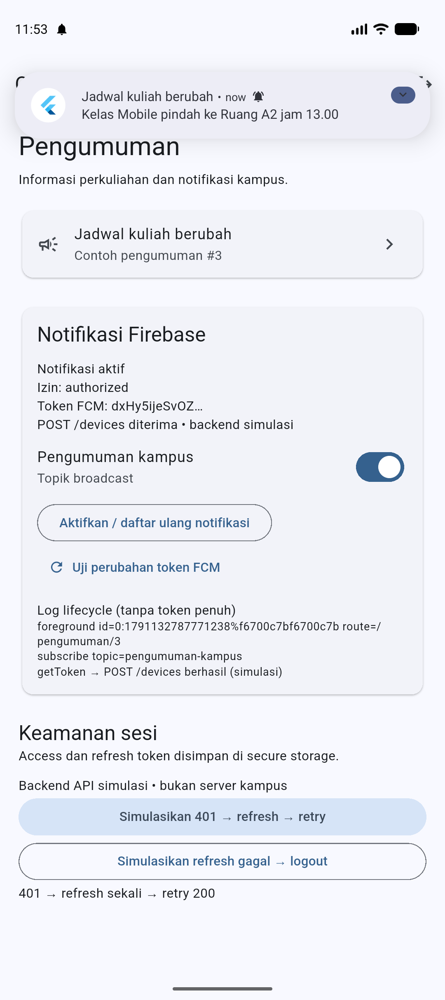 | 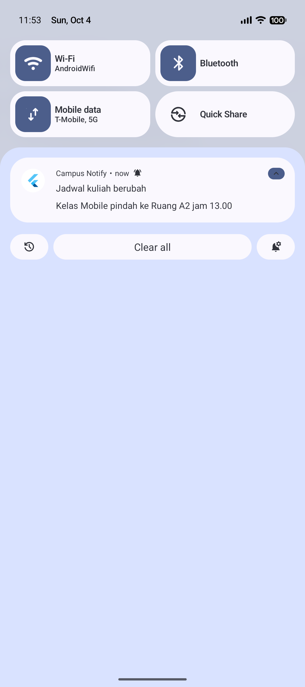 |  |
| Background | 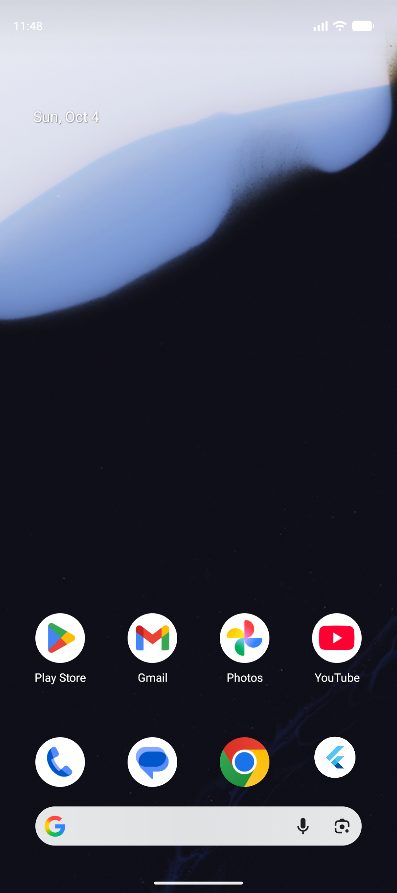 | 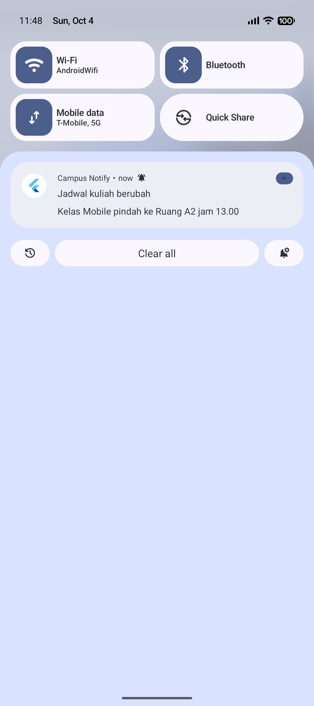 | 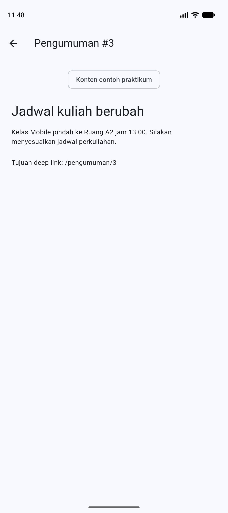 |
| Terminated |  | 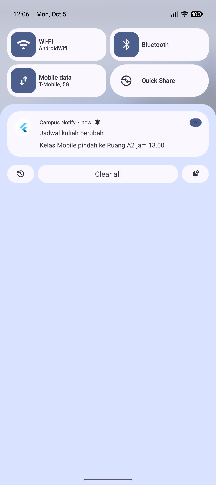 | 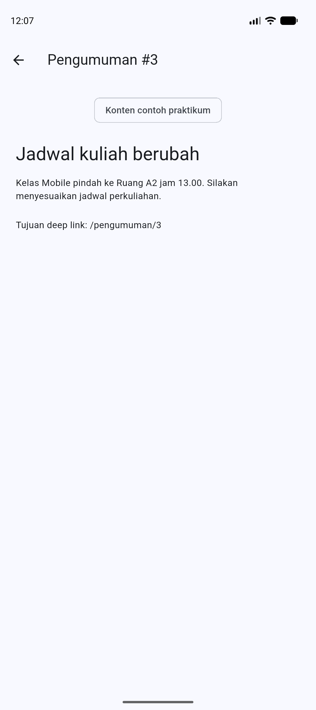 |

Baca tiap baris dari kondisi aplikasi, notifikasi, lalu hasil klik. Foreground menunjukkan banner di atas aplikasi terbuka dan event `foreground` di UI; background menunjukkan Home setelah menekan tombol Home; terminated menunjukkan **No recent items**, disertai pemeriksaan proses sudah berhenti sebelum pengiriman. Ketiga detail memang sama karena payload dan rute tujuannya sama. Perbedaan jalur klik dibuktikan oleh `foreground-click`, `background-click`, dan `terminated-click` pada [log FCM](docs/fcm_events.txt). Screenshot panel membuktikan kartu notifikasi, bukan tampilan banner heads-up yang melayang di atas aplikasi.

| Unsubscribe Topik | Subscribe Topik | Data-only Foreground |
| :---: | :---: | :---: |
| 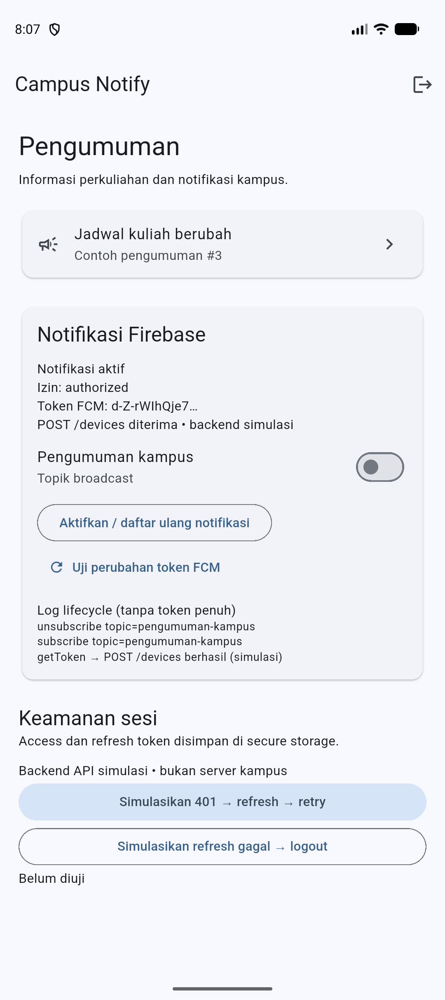 | 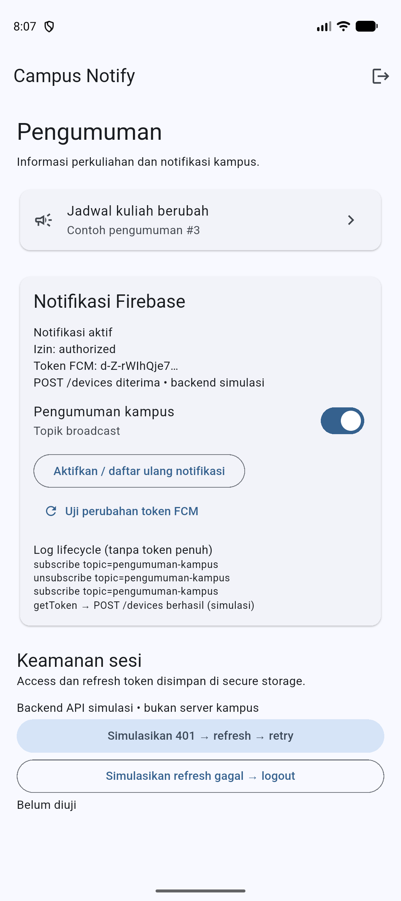 | 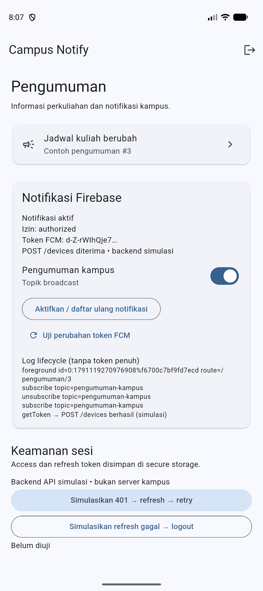 |

Matriks tiga state diuji memakai FCM HTTP v1 melalui akun Firebase CLI yang sudah login. Pengiriman melalui Firebase Console dibuktikan terpisah pada Praktikum 2. Screenshot notifikasi memperlihatkan kartu pada panel Android; log membedakan handler masing-masing state. Switch dan event terbaru membedakan subscribe dari unsubscribe. Data-only memperlihatkan event penerimaan dan tidak ada kartu baru; jenis payload dicocokkan dengan catatan pengiriman `data-only` pada [docs/fcm_sends.jsonl](docs/fcm_sends.jsonl).

---

## Tugas Utama: Campus Notification App

### Tujuan dan Fitur Utama

Aplikasi menggabungkan login mock, penyimpanan sesi aman, refresh token otomatis, dan pengumuman dengan navigasi dari notifikasi Firebase. Halaman utama menyediakan status permission, prefix token FCM, status registrasi perangkat, kontrol topik, dan demo 401.

### Tangkapan Layar

| Halaman Utama | Kontrol Sesi Setelah Demo 401 |
| :---: | :---: |
|  | 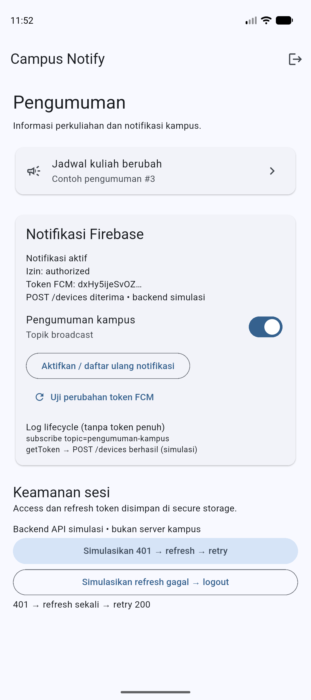 |

Gambar pertama menunjukkan pengumuman, izin, registrasi simulasi, dan kontrol topik. Gambar kedua menunjukkan hasil demo refresh pada bagian keamanan sesi. Daftar arti dan batas bukti setiap gambar tersedia di [docs/screenshot_audit.md](docs/screenshot_audit.md).

### Stack Teknologi

Flutter/Dart, Riverpod, GoRouter, Dio, `flutter_secure_storage`, `firebase_core`, `firebase_messaging`, dan `flutter_local_notifications`. Versi dependensi aktual dikunci di `pubspec.lock`.

### Struktur Proyek

```text
lib/
  main.dart
  routes.dart
  data/          # Auth, token store, API, error mapping, adapter demo
  providers/     # Auth dan PushService
  messaging/     # Handler dan service FCM
  pages/         # Login, home, detail pengumuman
test/auth_push_test.dart
docs/            # Prompt AI, draf, kontrak endpoint, payload, bukti
screenshots/     # Tangkapan emulator
```

### Cara Menjalankan

1. Siapkan Flutter SDK, Android SDK, dan emulator Android dengan Google Play Services.
2. Instal Firebase CLI dan FlutterFire CLI, lalu login ke akun yang mempunyai akses project Firebase.
3. Dari direktori modul, jalankan:

   ```bash
   flutter pub get
   dart pub global activate flutterfire_cli
   firebase login
   flutterfire configure --project=campus-notify-244107020049 --platforms=android
   ```

   Untuk salinan repo tanpa akses project tersebut, gunakan project Firebase sendiri. Package Android: `id.ac.polinema.campus_notify`. Konfigurasi `firebase_options.dart` dan `google-services.json` disediakan lokal melalui FlutterFire dan tidak masuk Git.

4. Jalankan emulator dan aplikasi:

   ```bash
   flutter emulators --launch Pixel_10
   flutter devices
   flutter run -d emulator-5554
   ```

   Nama emulator dan ID perangkat disesuaikan dengan hasil pada komputer masing-masing.

5. Login memakai email contoh, misalnya `demo@kampus.test`, dan kata sandi uji minimal 6 karakter. Ini bukan akun Firebase Auth. Izinkan notifikasi saat dialog Android tampil.
6. Pastikan topik pengumuman aktif. Dari terminal lain, kirim:

   ```bash
   node docs/send_notification.cjs campus-notify-244107020049
   ```

   Alternatif: Firebase Console → Messaging, buat pesan dengan custom data `route=/pengumuman/3` dan `id=3`.

### Batas Implementasi

FCM menggunakan Firebase nyata. Login dan endpoint `/devices` default merupakan simulasi, ditandai di UI. Token perangkat tidak disimpan pada backend persisten; kontrak produksi dijelaskan di [docs/device_endpoint.md](docs/device_endpoint.md). iOS memiliki titik integrasi dalam kode, tetapi konfigurasi APNs dan pengujian iOS belum dilakukan.

---

## Refactoring Challenge

### Perubahan yang Dilakukan

1. Semua rute aplikasi dipusatkan dalam `AppRoutes` di `lib/routes.dart`.
2. `routeFromMessage(Map<String, dynamic>)` menjadi fungsi murni yang menormalisasi slash dan membatasi navigasi ke rute internal.
3. `apiErrorMessage` di `lib/data/api_errors.dart` memetakan 401, timeout, dan kegagalan koneksi menjadi pesan untuk UI.

Hasil `flutter analyze` menunjukkan **No issues found!**:

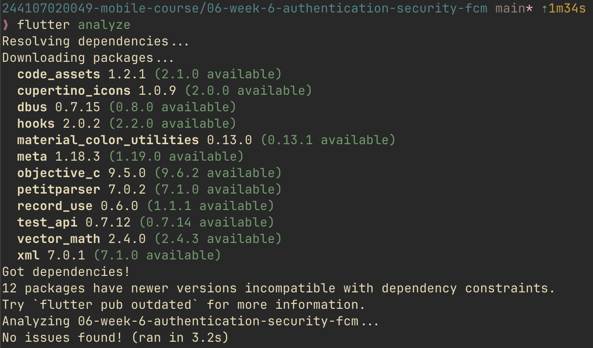

---

## Testing

### Pengujian Kode yang Diterapkan

Sesuai bagian testing pada modul, `test/auth_push_test.dart` menguji logika tanpa Firebase sungguhan:

1. Parsing rute kosong, rute tanpa slash, dan rute pengumuman; alamat eksternal diarahkan ke home.
2. Payload data membawa ID pengumuman yang sesuai dengan tujuan rute.
3. Provider membaca sesi dari fake token store; logout menghapus kedua token dan mengubah status login.
4. Request Dio menerima 401, refresh sekali, dan retry sukses; refresh tidak valid menghapus sesi.

Hasil: **4 test lulus**. Pengujian menggunakan fungsi dan provider produksi, bukan salinan logika pada file test. Penerimaan FCM dibuktikan terpisah melalui emulator.

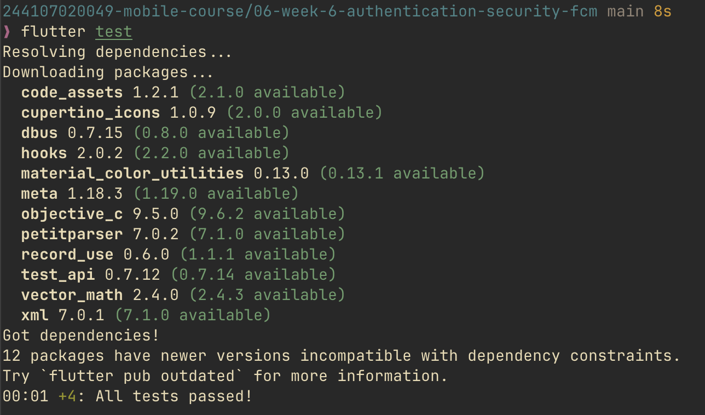

---

## Checklist Verifikasi

- [x] Token auth hanya disimpan melalui secure storage; token penuh tidak ditampilkan di UI/log laporan.
- [x] Refresh 401 dibatasi satu retry; refresh gagal membersihkan sesi.
- [x] Background handler top-level dengan `@pragma('vm:entry-point')`.
- [x] `getToken` dan `onTokenRefresh` melakukan POST `/devices` melalui jalur registrasi yang sama; default backend simulasi.
- [x] Topic digunakan untuk pengumuman umum; pesan personal membutuhkan token perangkat dan backend terverifikasi.
- [x] Empat unit test yang diminta modul lulus.
- [x] Bukti notifikasi dan klik ketiga app state pada emulator.
- [x] `flutter analyze` akhir bersih (`No issues found!`).

---

## AI Prompt Challenge

Prompt, snapshot output awal, daftar perbaikan, perbedaan Android/iOS, dan alasan teknis tersedia di [docs/ai_challenge.md](docs/ai_challenge.md). Hasil uji aktual dicatat di [docs/verification.md](docs/verification.md).

---

## Refleksi

### 1. Mengapa refresh token tidak boleh disimpan di SharedPreferences?

SharedPreferences tidak menyediakan penyimpanan rahasia yang terenkripsi. Refresh token biasanya berumur lebih panjang daripada access token; kebocorannya dapat memungkinkan penerbitan access token baru tanpa login ulang. Secure storage menggunakan mekanisme perlindungan platform. Backend tetap perlu mendukung pencabutan sesi dan rotasi refresh token.

### 2. Apa yang rusak bila onTokenRefresh diabaikan selama satu semester?

Token perangkat dapat berubah setelah reinstall, penghapusan data, atau rotasi. Backend yang hanya menyimpan token awal akan mengirim ke alamat lama, sehingga mahasiswa tidak menerima pengumuman meskipun aplikasi masih dipakai. Listener perlu mengirim token terbaru dan backend memperbarui asosiasi perangkat.

### 3. Kapan menggunakan topik dan kapan menggunakan token perangkat?

Topik cocok untuk broadcast, misalnya perubahan jadwal kuliah umum atau informasi kegiatan kampus. Token perangkat digunakan untuk tujuan personal, misalnya pemberitahuan nilai atau tagihan. Topik bukan mekanisme otorisasi untuk informasi pribadi; server harus menentukan penerima berdasarkan identitas terverifikasi.

### 4. Bagian mana dari draf AI yang diperbaiki, dan mengapa?

Parsing rute dipisahkan dari Firebase agar dapat diuji, error API dipetakan agar UI tidak menerima exception mentah, dan retry diberi penanda agar tidak loop. Klik foreground perlu callback navigasi langsung; menyimpan rute saja tidak cukup. Status registrasi juga diberi label simulasi supaya tidak disalahartikan sebagai bukti backend persisten.

---

## Referensi

- [Codelab Minggu 6](https://jti-polinema.github.io/flutter-codelab/06-minggu-6-authentication-security-fcm/index.html)
- [Firebase Flutter setup](https://firebase.google.com/docs/flutter/setup)
- [FCM Flutter client](https://firebase.google.com/docs/cloud-messaging/flutter/client)
- [FCM message types](https://firebase.google.com/docs/cloud-messaging/customize-messages/set-message-type)
